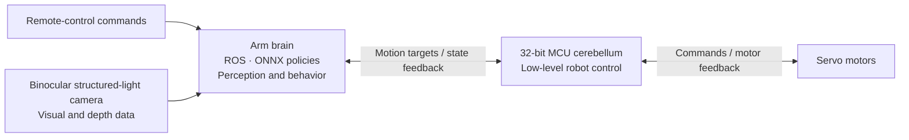

<p align="center">
  <a href="https://www.wamotechology.com">
    <picture>
      <source media="(prefers-color-scheme: dark)" srcset="assets/branding/wamotech-symbol-white.png">
      
    </picture>
    <br>
    <picture>
      <source media="(prefers-color-scheme: dark)" srcset="assets/branding/wamotech-wordmark-white.png">
      
    </picture>
  </a>
</p>

# Wamoduck

**An expressive little duck. A platform to explore motion, perception, and autonomous behavior.**

English | [简体中文](README.zh-CN.md)


*Rendered from the Wamoduck URDF. This scripted joint-motion preview illustrates articulation; it is not hardware footage or an ONNX policy rollout.*

Wamoduck is a **15-DOF open-source biped robot under development by Wamotech**. It brings together servo feedback control, a two-level MCU/Arm computing architecture, binocular structured-light vision, and an extensible mechanical design. The aim is to give developers a platform they can study, adapt, and build on—from making a robot move to giving it new ways to perceive and interact with its surroundings.

**Current stage: mechanical prototyping and hardware/software integration. MuJoCo simulation has been completed; physical integration and debugging are ongoing.**

## What makes Wamoduck interesting

| Feature | What it enables |
| --- | --- |
| **Servo-based closed-loop control** | Motor feedback closes the loop between motion commands and execution, providing a basis for motion tracking and hardware tuning. |
| **A low-level “cerebellum” and a higher-level “brain”** | A 32-bit MCU handles low-level robot control, while an Arm-based computer supports ROS and ONNX policy inference. This separates motor control from higher-level perception and behavior. |
| **Onboard visual perception** | A binocular structured-light camera supplies visual and depth information for local scene recognition and spatial modeling. |
| **An extensible structure** | The mechanical design leaves room to adapt structures, sensors, and peripherals as experiments evolve, alongside changes to the computing and control stack. |

### System architecture



This architecture is also being experimentally applied to **intelligent wearable robot projects**, exploring how control, perception, and policy components can be reused across different robot forms.

## Development progress

- **Mechanical prototyping and integration:** prototype fabrication and hardware/software debugging are in progress.
- **MuJoCo simulation:** simulation work has been completed. The project supports an ONNX deployment approach combining remote-control commands with policy-driven autonomous actions, similar in approach to [Microduck](https://github.com/pollen-robotics/microduck) and [microduck_rl](https://github.com/pollen-robotics/microduck_rl). Integration on the physical robot is ongoing.
- **Trained policies, measured (simulation):** six behaviours are trained and playable from one internal menu — standing against pushes, knock-down recovery, get-up from a random lying pose, keyboard walking, 1 cm rough terrain, and sit/stand. Latest measured, on 2026-09-16: a **40.5 N** push threshold while standing, **5/5** end-to-end knock-down → get-up → nominal-stance trials, **79.7 %** survival across 1 cm terrain, and get-up reaching a standing pose in **64/64** environments while the strict "back to the saved nominal pose" criterion is still **0/64**. Side-stepping and in-place turning are still broken. The figures, the tools that produced them, and the definition of "standing" are documented in [measured capabilities](docs/capabilities.md).
- **Trained policies you can run (simulation):** five of them are published here as ONNX files, together with the **MJCF model they were trained on** and a single-file CPU runner. `pip install mujoco onnxruntime numpy`, then `python wamoduck_sim.py --policy stand`. Start at [Run the trained policies in MuJoCo](docs/simulation.md); it writes out the observation and action contract item by item and reports what our own CPU checks measured. This is still Sim2Sim — there are no hardware results in this repository.
- **Reference gait:** a walking reference trajectory for this URDF is published with the model, together with a MATLAB player. See [Try the reference gait in MATLAB](#try-the-reference-gait-in-matlab). It is a plan, not one of the trained policies above.
- **3D printing:** the [standing calibration fixture](hardware/fixtures/standing-zero/README.md) includes four parts and an H2D PLA project. A separate [160 mm A1 mini figurine](hardware/printable/wamoduck-a1mini-standing/README.md) provides a single-piece display model.
- **Public materials:** this repository currently contains simplified CAD, the URDF and meshes, model parameters, a reference gait with its player, **five trained ONNX policies with the MJCF they were trained on and a CPU runner**, and bilingual documentation. The simulation/training code, the checkpoints behind the measured results, their evaluation tools, runtime software, electronics, and a complete build guide are not yet included here.
- **Ongoing updates:** we will continue sharing mechanical revisions, integration progress, and software and hardware documentation as the project develops. Follow the [roadmap](docs/roadmap.md) for the next steps.

The project progress above and the files currently published are different scopes. The bundled [validation record](models/wmduck/validation.json) covers this URDF package's structural and import checks, rather than the project's full simulation or physical-robot validation.


*Pushed over, then recovers to the nominal stance — a **simulation** screen recording of the trained policies `stand_v3` and `getup_v18` in MuJoCo, not hardware footage. Measured figures, the protocols behind them, and the behaviours that still fail are on the [measured capability board](docs/capabilities.md) / [实测能力清单](docs/capabilities.zh-CN.md); the same session is published at full length as [wamoduck-force-test-demo.mp4](assets/wamoduck-force-test-demo.mp4).*

## 15 joints, from footsteps to expression

The finalized URDF describes **15 rotational DOF = 5 left-leg + 5 right-leg + 5 neck/head/beak**:

| Group | DOF | Joint sequence |
| --- | ---: | --- |
| Left leg | 5 | Hip yaw → hip roll → hip pitch → knee → ankle |
| Right leg | 5 | Hip yaw → hip roll → hip pitch → knee → ankle |
| Neck, head, and beak | 5 | Neck pitch → head pitch → head yaw → head roll → mouth |

The neck contributes one DOF, the head three, and the beak one. Together they allow expressive nods, turns, tilts, and beak movements in addition to the two leg chains.

There are **17 links**: 16 mechanical rigid bodies plus a fixed IMU reference link. The IMU reference does not add an actuated DOF. The saved standing pose is `q=0`, with bent legs and an inclined neck; it is not the motor encoder zero. See the [model guide](docs/model.en.md) for exact joint names, axes, and limits, and the [animation notes](assets/README.md) for how the preview was made.

<details>
<summary>Explore the 15 joint origins in four views</summary>


Orthographic views of the finalized URDF at the saved `q=0` pose. Labels 01–05 identify the left leg, 06–10 the right leg, 11 the neck, 12–14 the head, and 15 the beak. These labels are diagram indices, not motor IDs. Red, green, and blue mark X, Y, and Z; the joint-name legend is included in the image.

</details>

## Try the reference gait in MATLAB


*Reference quasi-static gait, replayed from the public URDF by prescribing the joint angles in [tools/matlab/data/](tools/matlab/data/) and running forward kinematics. It is a plan, not a trained policy and not hardware footage.*

A walking reference trajectory for this URDF is included, together with a MATLAB player:

```matlab
cd <repo>              % the folder containing models/ and tools/
addpath('tools/matlab')
wamoduck_play          % interactive player
wamoduck_play(true)    % headless self-test: units, joint limits, ground contact
```

The player steps through the data, plots all 15 joint torques against the motor's rated and peak values, and shows a per-joint angle/torque table. Two data sets ship with it: one steady-state gait cycle (2.0 s, loops seamlessly) and the full 1 m walk.

The published CSV files contain model-computed joint angles and torque estimates. Their largest absolute torque is **2.50815 N·m**, at the right knee in the full walk. The player retains its existing smoke self-test. The original higher-rate planner and its IK/dynamics generation code are not included; see the [gait guide](docs/matlab.en.md) for the distinction between reproducible CSV checks and reported planning results.

The reference trajectory uses small alternating foot lifts. Its model-based playback does not establish dynamic balance. The separate planning analysis identified limited lateral centre-of-mass travel and the absence of ankle roll; see the [gait guide](docs/matlab.en.md) for its scope and known limits.

## Run the trained policies in MuJoCo

Five of the trained policies are published as ONNX files, each with the MJCF model it was trained on, plus a
single-file runner. The runner needs only `mujoco`, `onnxruntime` and `numpy` — no GPU, no training stack:

```bash
pip install mujoco onnxruntime numpy
python wamoduck_sim.py --list                 # standing, get-up, sit/stand, walking, 1 cm terrain
python wamoduck_sim.py --policy stand         # interactive viewer
python wamoduck_sim.py --policy walk --vx 0.3
python wamoduck_sim.py --policy getup --spawn lie-back
```

Our own CPU checks, run through this published code path, give: `stand` holding **0.54°** of tilt and
1 mm of drift over 5 s (passing even the strict "nominal stance" criterion), `getup` standing up from all
five published lying poses in 6 s, and `walk` covering **1.482 m** of a commanded 1.500 m at 0.3 m/s.

Read the [simulation guide](docs/simulation.md) / [中文仿真指南](docs/simulation.zh-CN.md) before using the
files: it writes out the observation layout and the action mapping item by item, explains why the ONNX
already contains the observation normalizer, explains why the bundled **MJCF must be used instead of the
URDF**, and lists the known gaps — including that walking's in-place turning and side-stepping do not work.
**This is Sim2Sim only.** There are no hardware results in this repository and no policy here has been
tested on a physical robot.

## Start here

| I want to… | Open |
| --- | --- |
| Inspect or adapt individual mechanical parts | [20 STEP models](hardware/step/) · [Mechanical guide](docs/mechanical.en.md) |
| Print the standing calibration fixture | [4 parts + H2D PLA project](hardware/fixtures/standing-zero/README.md) · [Quantities](hardware/fixtures/standing-zero/print-parts.csv) |
| Print a small static display model | [160 mm A1 mini figurine](hardware/printable/wamoduck-a1mini-standing/README.md) |
| Explore the native assembly | [SolidWorks files](hardware/solidworks/) · [Opening instructions](docs/mechanical.en.md#solidworks-assembly) |
| View the robot and inspect its joints | [URDF and meshes](models/wmduck/) · [Model guide](docs/model.en.md) |
| **Run the trained policies myself in MuJoCo** | [Simulation guide](docs/simulation.md) · [ONNX policies](policies/) · [`wamoduck_sim.py`](wamoduck_sim.py) |
| Watch the reference gait / play with it in MATLAB | [Gait guide](docs/matlab.en.md) · [MATLAB player](tools/matlab/) · [Walk video](assets/wamoduck-gait-walk.mp4) |
| Understand the modeled components | [Component inventory](docs/components.md) |
| See what the trained policies can actually do, and what still fails | [Measured capabilities](docs/capabilities.md) |
| Help improve the project | [Contributing](CONTRIBUTING.md) · [Roadmap](docs/roadmap.md) |

Download or clone the complete repository before opening an assembly or URDF. Those files need the parts or meshes supplied alongside them.

## At a glance

| Item | Current model |
| --- | --- |
| Rotational joints | 15: left leg 5 + right leg 5 + neck/head/beak 5 |
| Robot description | URDF; 16 mechanical links + 1 fixed IMU reference link |
| Geometry | 20 simplified STEP part models; 20 STL meshes for the URDF |
| Approximate model envelope at the saved pose | 181.5 × 221.2 × 390.8 mm (X × Y × Z) |
| Estimated model mass | 3.751 kg; CAD values with a measured motor mass override, not a measured robot weight |
| Head-chain share of that mass | 1.654 kg = 44.1 %: `neck_pitch_link` through `mouth_link` |
| Model units | m, kg, rad; STEP files declare mm |
| Trained policies (simulated) | 6: standing against pushes, knock-down recovery, get-up, keyboard walking, 1 cm rough terrain, sit/stand |
| Push threshold while standing (simulated) | 40.5 N: the smallest single horizontal 0.2 s shove that topples at least half of 64 environments (40 N topples 45.3 %) |
| Knocked down → get up → nominal stance (simulated) | 5/5 trials; "did not fall again after standing up" 4/5 |
| 1 cm rough terrain (simulated) | 51/64 (79.7 %) survive 12 s at a 0.3 m/s command; mean speed 61 % of the command |

The mass and envelope describe the supplied model, not certified hardware specifications. See the [model assumptions](docs/model.en.md) before using its inertias, motor values, or joint ranges. The last four rows are simulation results for the trained policies, measured on 2026-09-16 in the private development environment; they are **not hardware measurements**. Five of the policies are now published with a runner, so their behaviour can be re-run here in simulation — see the [simulation guide](docs/simulation.md) for exactly what is and is not reproducible — but the internal measurement protocols and tools are still private. See [measured capabilities](docs/capabilities.md) for the methods, the tools, and the parts that do not work.

## What is included

```text
Wamoduck/
├── hardware/
│   ├── step/             # Robot structure and purchased-component references, mm
│   ├── solidworks/       # Simplified native parts and assemblies
│   ├── robot-structure.csv # Geometry roles and modeled instance quantities
│   ├── fixtures/standing-zero/ # 4 STEP + 4 printable STL + H2D project
│   └── printable/        # Static display model and A1 mini project
├── models/wmduck/        # URDF, meshes, joint data, and import checks
│   └── mjcf/             # The MJCF models the policies were trained on
├── policies/             # Five trained ONNX policies
├── wamoduck_sim.py       # Single-file CPU runner (mujoco + onnxruntime + numpy)
├── tools/matlab/         # Reference-gait data and the MATLAB player
├── assets/              # Model preview and gait preview
├── docs/                # Bilingual guides: mechanical, model, gait, simulation, capabilities, roadmap
├── CONTRIBUTING.md
└── LICENSE
```

Robot STEP files support geometry exchange and slicing of the selected structural geometry. The [manufacturing map](hardware/robot-structure.csv) distinguishes structural parts from motors, bearings, and electronics supplied as assembly references. The STL files under `models/wmduck/meshes/` use meters for robot visualization and collision; use the millimeter STL files in [the fixture package](hardware/fixtures/standing-zero/README.md) to print the jig. Joint limits are estimates from single-joint geometry checks and do not guarantee collision-free combined motion.

The standing fixture includes four printable parts, a two-plate H2D PLA project, six M3 screw specifications, and fitting/calibration instructions. Its digital geometry has been checked; physical print fit and repeatability remain to be measured. A complete working robot additionally needs a verified procurement BOM, structural manufacturing specifications, robot assembly instructions, wiring, and control software. The [roadmap](docs/roadmap.md) tracks these deliverables.

## Build along with us

Interested in servo control, robot perception, policy deployment, or your own mechanical variation? **Star the project to follow its progress**, share ideas through Issues, or contribute improvements through a pull request. Contributions in English and Chinese are welcome; start with the [contribution guide](CONTRIBUTING.md).

## Contact

- Email: [business@wamotechology.com](mailto:business@wamotechology.com)
- Website: [www.wamotechology.com](https://www.wamotechology.com)

## References and license

The documentation structure draws on [Open Duck Mini](https://github.com/apirrone/Open_Duck_Mini) and [Pollen Robotics Microduck](https://github.com/pollen-robotics/microduck): accessible design files, clear model assumptions, and separate build/runtime/training instructions. See [references and scope](docs/references.md) for the exact sources and distinctions.

This repository retains its existing [MIT license](LICENSE), copyright © 2026 Wamotech. Referenced projects and third-party components retain their own licenses and rights. Their dimensions, controllers, and build instructions should not be assumed compatible with Wamoduck.
