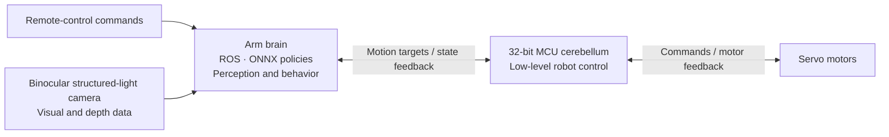

# Wamoduck

**An expressive little duck. A platform to explore motion, perception, and autonomous behavior.**

English | [简体中文](README.zh-CN.md)


*Rendered from the Wamoduck URDF. This scripted joint-motion preview illustrates articulation; it is not hardware footage or an ONNX policy rollout.*

Wamoduck is a **15-DOF open-source biped robot under development by Wamotech**. It brings together servo feedback control, a two-level MCU/Arm computing architecture, binocular structured-light vision, and an extensible mechanical design. The aim is to give developers a platform they can study, adapt, and build on—from making a robot move to giving it new ways to perceive and interact with its surroundings.

**Current stage: mechanical prototyping and hardware/software integration. MuJoCo simulation has been completed; physical integration and debugging are ongoing.**

## What makes Wamoduck interesting

| Feature | What it enables |
| --- | --- |
| **Servo-based closed-loop control** | Motor feedback closes the loop between motion commands and execution, providing a basis for motion tracking and hardware tuning. |
| **A low-level “cerebellum” and a higher-level “brain”** | A 32-bit MCU handles low-level robot control, while an Arm-based computer supports ROS and ONNX policy inference. This separates motor control from higher-level perception and behavior. |
| **Onboard visual perception** | A binocular structured-light camera supplies visual and depth information for local scene recognition and spatial modeling. |
| **An extensible structure** | The mechanical design leaves room to adapt structures, sensors, and peripherals as experiments evolve, alongside changes to the computing and control stack. |

### System architecture



This architecture is also being experimentally applied to **intelligent wearable robot projects**, exploring how control, perception, and policy components can be reused across different robot forms.

## Development progress

- **Mechanical prototyping and integration:** prototype fabrication and hardware/software debugging are in progress.
- **MuJoCo simulation:** simulation work has been completed. The project supports an ONNX deployment approach combining remote-control commands with policy-driven autonomous actions, similar in approach to [Microduck](https://github.com/pollen-robotics/microduck) and [microduck_rl](https://github.com/pollen-robotics/microduck_rl). Integration on the physical robot is ongoing.
- **Public materials:** this repository currently contains simplified CAD, the URDF and meshes, model parameters, and bilingual documentation. Simulation/training code, ONNX policy files, runtime software, electronics, and a complete build guide are not yet included here.
- **Ongoing updates:** we will continue sharing mechanical revisions, integration progress, and software and hardware documentation as the project develops. Follow the [roadmap](docs/roadmap.md) for the next steps.

The project progress above and the files currently published are different scopes. The bundled [validation record](models/wmduck/validation.json) covers this URDF package's structural and import checks, rather than the project's full simulation or physical-robot validation.

## 15 joints, from footsteps to expression

The finalized URDF describes **15 rotational DOF = 5 left-leg + 5 right-leg + 5 neck/head/beak**:

| Group | DOF | Joint sequence |
| --- | ---: | --- |
| Left leg | 5 | Hip yaw → hip roll → hip pitch → knee → ankle |
| Right leg | 5 | Hip yaw → hip roll → hip pitch → knee → ankle |
| Neck, head, and beak | 5 | Neck pitch → head pitch → head yaw → head roll → mouth |

The neck contributes one DOF, the head three, and the beak one. Together they allow expressive nods, turns, tilts, and beak movements in addition to the two leg chains.

There are **17 links**: 16 mechanical rigid bodies plus a fixed IMU reference link. The IMU reference does not add an actuated DOF. The saved standing pose is `q=0`, with bent legs and an inclined neck; it is not the motor encoder zero. See the [model guide](docs/model.en.md) for exact joint names, axes, and limits, and the [animation notes](assets/README.md) for how the preview was made.

<details>
<summary>Explore the 15 joint origins in four views</summary>


Orthographic views of the finalized URDF at the saved `q=0` pose. Labels 01–05 identify the left leg, 06–10 the right leg, 11 the neck, 12–14 the head, and 15 the beak. These labels are diagram indices, not motor IDs. Red, green, and blue mark X, Y, and Z; the joint-name legend is included in the image.

</details>

## Start here

| I want to… | Open |
| --- | --- |
| Inspect or adapt individual mechanical parts | [20 STEP models](hardware/step/) · [Mechanical guide](docs/mechanical.en.md) |
| Explore the native assembly | [SolidWorks files](hardware/solidworks/) · [Opening instructions](docs/mechanical.en.md#solidworks-assembly) |
| View the robot and inspect its joints | [URDF and meshes](models/wmduck/) · [Model guide](docs/model.en.md) |
| Understand the modeled components | [Component inventory](docs/components.md) |
| Help improve the project | [Contributing](CONTRIBUTING.md) · [Roadmap](docs/roadmap.md) |

Download or clone the complete repository before opening an assembly or URDF. Those files need the parts or meshes supplied alongside them.

## At a glance

| Item | Current model |
| --- | --- |
| Rotational joints | 15: left leg 5 + right leg 5 + neck/head/beak 5 |
| Robot description | URDF; 16 mechanical links + 1 fixed IMU reference link |
| Geometry | 20 simplified STEP part models; 20 STL meshes for the URDF |
| Approximate model envelope at the saved pose | 181.5 × 221.2 × 390.8 mm (X × Y × Z) |
| Estimated model mass | 3.886 kg; CAD values with motor mass overrides, not a measured robot weight |
| Model units | m, kg, rad; STEP files declare mm |

The mass and envelope describe the supplied model, not certified hardware specifications. See the [model assumptions](docs/model.en.md) before using its inertias, motor values, or joint ranges.

## What is included

```text
Wamoduck/
├── hardware/
│   ├── step/             # Individual simplified parts, millimeters
│   └── solidworks/       # Simplified native parts and assemblies
├── models/wmduck/        # URDF, meshes, joint data, and import checks
├── assets/              # Model preview
├── docs/                # Bilingual mechanical and model guides
├── CONTRIBUTING.md
└── LICENSE
```

The STEP files support geometry exchange. The STL files are robot visualization and initial collision meshes, **not a validated set of printable parts**. Joint limits are estimates from single-joint geometry checks and do not guarantee collision-free combined motion.

For physical reproduction from the public files, a verified procurement BOM, manufacturing specifications, assembly instructions, wiring, calibration, and control software still need to be published. The [roadmap](docs/roadmap.md) tracks these deliverables.

## Build along with us

Interested in servo control, robot perception, policy deployment, or your own mechanical variation? **Star the project to follow its progress**, share ideas through Issues, or contribute improvements through a pull request. Contributions in English and Chinese are welcome; start with the [contribution guide](CONTRIBUTING.md).

## References and license

The documentation structure draws on [Open Duck Mini](https://github.com/apirrone/Open_Duck_Mini) and [Pollen Robotics Microduck](https://github.com/pollen-robotics/microduck): accessible design files, clear model assumptions, and separate build/runtime/training instructions. See [references and scope](docs/references.md) for the exact sources and distinctions.

This repository retains its existing [MIT license](LICENSE), copyright © 2026 Wamotech. Referenced projects and third-party components retain their own licenses and rights. Their dimensions, controllers, and build instructions should not be assumed compatible with Wamoduck.
