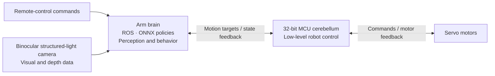

<p align="center">
  <a href="https://www.wamotechology.com">
    <picture>
      <source media="(prefers-color-scheme: dark)" srcset="assets/branding/wamotech-symbol-white.png">
      
    </picture>
    <br>
    <picture>
      <source media="(prefers-color-scheme: dark)" srcset="assets/branding/wamotech-wordmark-white.png">
      
    </picture>
  </a>
</p>

# Wamoduck

**An expressive little duck. A platform to explore motion, perception, and autonomous behavior.**

English | [简体中文](README.zh-CN.md)


*Rendered from the Wamoduck URDF. This scripted joint-motion preview illustrates articulation; it is not hardware footage or an ONNX policy rollout.*

## What this is

Wamoduck is a **15-DOF open-source biped duck robot**. Wamotech builds it as a small, approachable
platform for experimenting with motion, perception, and autonomous behaviour.

The project is in **mechanical prototyping and hardware/software integration**. The MuJoCo simulation
work is finished. The physical robot is still being assembled and debugged.

This repository is the public slice of that work. It gives you four things:

- the **CAD, URDF, and meshes** of the robot,
- a **reference walking gait** with a MATLAB player,
- **five trained policies** you can run yourself, in about five minutes,
- print files for a **standing fixture** and a small **display model**.

> ### Read this before you quote anything from here
>
> **Every result in this repository is a simulation result.** There is no hardware data anywhere in it,
> and no policy in it has ever been tested on a physical robot. "It stands in MuJoCo" is not a claim
> that it stands on the real machine.

**The quickest way in** is to run the policies. No GPU, no training framework, no MuJoCo experience.

## What it can do today, and what it cannot

Six behaviours were trained and measured in simulation on **2026-09-16**. Five of them ship here as ONNX
files you can run on your own machine.

| What it does | Policy | Measured result (simulation) |
| --- | --- | --- |
| Stands still, and takes a shove | `stand_v3` | Push threshold **40.5 N** — the smallest single horizontal 0.2 s shove that topples at least half of 64 environments. 40 N topples 45.3 % of them, and 0 to 24 N topples none. |
| Knocked down → gets up → back to the nominal stance | `stand_v3` + `getup_v18` | **5/5** end-to-end trials. "Did not fall again after standing up": **4/5**. |
| Gets up from a random lying pose | `getup_v18` | Standing at the end: **64/64** (loose criterion). |
| Walks on flat ground | `walk_v4r` | Forward walking works. **Turning and side-stepping do not.** |
| Walks over 1 cm rough terrain | `rough_v2` | **51/64 (79.7 %)** survive 12 s at a 0.3 m/s command. Mean speed is **61 %** of the command. |
| Sits down and stands back up | `sit_stand_v2` | Interactive height control. No acceptance numbers in this batch. |

### What still does not work

- **In-place turning is broken.** A 0.5 rad/s yaw command produced **+0.3°** of rotation in 10 s.
- **Side-stepping drags the robot round.** A +0.30 m/s sideways command produced +0.218 m/s sideways
  *and* **+520.4°** of uncommanded yaw. Our own CPU run shows a small version of the same thing: over
  5 s of straight-ahead walking it drifted **0.328 m** sideways.
- **Get-up does not reach the saved nominal pose.** It gets up and stands reliably — 64/64 — but the
  strict criterion "back to the saved nominal pose" is still **0/64**. The remaining error is concentrated
  in the second link of the head chain.
- **There is no hardware data at all.** Nothing in this repository was measured on a physical robot.

These are the parts we would rather state than let you discover. The full protocols, the tools behind
every figure, and the exact definition of "standing" are on the
[measured capability board](docs/capabilities.md) / [实测能力清单](docs/capabilities.zh-CN.md).

## Try it in 5 minutes

```bash
pip install mujoco onnxruntime numpy

git clone <this repository>
cd Wamoduck
python wamoduck_sim.py
```

One window opens, and all five policies run inside it. Press a number key to switch:

| Key | Policy | What you should see |
| --- | --- | --- |
| `1` | `stand` | Standing still. Drag it with the mouse and it finds its balance again. |
| `2` | `getup` | Starts lying on the ground, then stands up. |
| `3` | `sitstand` | Press `m` to crouch down and stand back up. |
| `4` | `walk` | Arrow keys (or `w` `a` `s` `d`) drive it; `e` and `z` turn. |
| `5` | `rough` | The same walking, over 1 cm curbs. |

The runner needs only `mujoco`, `onnxruntime`, and `numpy` — no mjlab, no torch, no CUDA. A few useful
flags:

```bash
python wamoduck_sim.py --list                    # what is published
python wamoduck_sim.py --policy walk --vx 0.3    # start on walking at 0.3 m/s
python wamoduck_sim.py --policy getup --spawn lie-back
python wamoduck_sim.py --policy stand --check    # contract self-test, no window
```

**What our own CPU runs measured, through this same published code path:** `stand` holds **0.54°** of
tilt and 1 mm of drift over 5 s — good enough to pass even the strict nominal-stance criterion; `getup`
stands up from all five published lying poses within 6 s; and `walk` covers **1.482 m** of a commanded
**1.500 m** at 0.3 m/s.

Before you use the files, read the [simulation guide](docs/simulation.md) / [中文仿真指南](docs/simulation.zh-CN.md).
It writes out the observation layout and the action mapping item by item, explains why the ONNX already
contains the observation normalizer, explains why you **must** use the bundled MJCF and not the URDF, and
lists the known gaps.

## There is also a ROS 2 path

If you would rather not touch a physics engine, [`ros2/`](ros2/README.md) is a second way in. It is a
ROS 2 **Jazzy** chain for the same robot: the description loads in RViz, the reference gait replays as
`sensor_msgs/JointState`, and the 46-byte deployment protocol ships with a unit-tested, ROS-free codec.

Stage 1 (packages) and stage 2 (RViz visualisation) are built and verified. Read the
[ROS 2 guide](ros2/README.md) / [中文版](ros2/README.zh-CN.md) for the commands.

**What that path does not claim:**

| Area | State |
| --- | --- |
| Machine | Verified only on **WSL2 Ubuntu 24.04, x86_64**. Nothing has been built or run on the RDK X5's ARM64 userspace, so availability there is **unverified**. |
| Hardware | **Not verified.** No serial port, no CAN bus, no motors, no IMU. The protocol's `serial` transport has never been opened. |
| `policy_node` end to end | **Not run.** It is a skeleton: it assembles observations and never infers, because `onnxruntime` is not installed. |
| Gazebo and MoveIt | **Not started.** Nothing in `ros2/` runs Gazebo. |
| Physics | RViz integrates nothing and applies no gravity, so a gait that looks plausible on screen has proven nothing about dynamics or balance. **MuJoCo remains the physics reference for this project.** |

## Other ways to explore

### Try the reference gait in MATLAB


*Reference quasi-static gait, replayed from the public URDF by prescribing the joint angles in [tools/matlab/data/](tools/matlab/data/) and running forward kinematics. It is a plan, not a trained policy and not hardware footage.*

A walking reference trajectory for this URDF is included, together with a MATLAB player:

```matlab
cd <repo>              % the folder containing models/ and tools/
addpath('tools/matlab')
wamoduck_play          % interactive player
wamoduck_play(true)    % headless self-test: units, joint limits, ground contact
```

The player steps through the data, plots all 15 joint torques against the motor's rated and peak values,
and shows a per-joint angle/torque table. Two data sets ship with it: one steady-state gait cycle
(2.0 s, loops seamlessly) and the full 1 m walk.

The published CSV files contain model-computed joint angles and torque estimates. Their largest absolute
torque is **2.50815 N·m**, at the right knee in the full walk. The original higher-rate planner and its
IK/dynamics generation code are not included; see the [gait guide](docs/matlab.en.md) for the difference
between reproducible CSV checks and reported planning results.

The reference trajectory uses small alternating foot lifts. Its model-based playback does not establish
dynamic balance. The separate planning analysis identified limited lateral centre-of-mass travel and the
absence of an ankle roll; see the [gait guide](docs/matlab.en.md) for its scope and known limits.

### Print something

- The [standing calibration fixture](hardware/fixtures/standing-zero/README.md) has four printable parts,
  a two-plate H2D PLA project, six M3 screw specifications, and fitting instructions. Its digital
  geometry has been checked; **physical print fit and repeatability are still unmeasured**.
- The [160 mm A1 mini figurine](hardware/printable/wamoduck-a1mini-standing/README.md) is a separate
  single-piece display model.

### Open the CAD or the model

- [20 simplified STEP part models](hardware/step/) and the [native SolidWorks assembly](hardware/solidworks/)
  ([opening instructions](docs/mechanical.en.md#solidworks-assembly)).
- The [URDF and its meshes](models/wmduck/), with the [model guide](docs/model.en.md) for joint names,
  axes, and limits.
- The [component inventory](docs/components.md) for what the model actually contains.

Download or clone the complete repository before opening an assembly or URDF: those files need the parts
or meshes supplied alongside them.

## Where to go next

| I want to… | Open |
| --- | --- |
| **Run the trained policies myself in MuJoCo** | [Simulation guide](docs/simulation.md) · [ONNX policies](policies/) · [`wamoduck_sim.py`](wamoduck_sim.py) |
| **Use ROS 2 instead of MuJoCo** | [ROS 2 guide](ros2/README.md) |
| See what the trained policies can actually do, and what still fails | [Measured capabilities](docs/capabilities.md) |
| Inspect or adapt individual mechanical parts | [20 STEP models](hardware/step/) · [Mechanical guide](docs/mechanical.en.md) |
| Print the standing calibration fixture | [Four parts + H2D PLA project](hardware/fixtures/standing-zero/README.md) · [Quantities](hardware/fixtures/standing-zero/print-parts.csv) |
| Print a small static display model | [160 mm A1 mini figurine](hardware/printable/wamoduck-a1mini-standing/README.md) |
| Explore the native assembly | [SolidWorks files](hardware/solidworks/) · [Opening instructions](docs/mechanical.en.md#solidworks-assembly) |
| View the robot and inspect its joints | [URDF and meshes](models/wmduck/) · [Model guide](docs/model.en.md) |
| Watch the reference gait / play with it in MATLAB | [Gait guide](docs/matlab.en.md) · [MATLAB player](tools/matlab/) · [Walk video](assets/wamoduck-gait-walk.mp4) |
| Understand the modeled components | [Component inventory](docs/components.md) |
| Help improve the project | [Contributing](CONTRIBUTING.md) · [Roadmap](docs/roadmap.md) |

## The robot itself

| Feature | What it enables |
| --- | --- |
| **Servo-based closed-loop control** | Motor feedback closes the loop between motion commands and execution, providing a basis for motion tracking and hardware tuning. |
| **A low-level “cerebellum” and a higher-level “brain”** | A 32-bit MCU handles low-level robot control, while an Arm-based computer supports ROS and ONNX policy inference. This separates motor control from higher-level perception and behavior. |
| **Onboard visual perception** | A binocular structured-light camera supplies visual and depth information for local scene recognition and spatial modeling. |
| **An extensible structure** | The mechanical design leaves room to adapt structures, sensors, and peripherals as experiments evolve, alongside changes to the computing and control stack. |

### System architecture



This architecture is also being experimentally applied to **intelligent wearable robot projects**, exploring how control, perception, and policy components can be reused across different robot forms.

### 15 joints, from footsteps to expression

The finalized URDF describes **15 rotational DOF = 5 left-leg + 5 right-leg + 5 neck/head/beak**:

| Group | DOF | Joint sequence |
| --- | ---: | --- |
| Left leg | 5 | Hip yaw → hip roll → hip pitch → knee → ankle |
| Right leg | 5 | Hip yaw → hip roll → hip pitch → knee → ankle |
| Neck, head, and beak | 5 | Neck pitch → head pitch → head yaw → head roll → mouth |

The neck contributes 1 DOF, the head 3, and the beak 1. Together they allow expressive nods, turns, tilts, and beak movements in addition to the two leg chains.

There are **17 links**: 16 mechanical rigid bodies plus 1 fixed IMU reference link. The IMU reference does not add an actuated DOF. The saved standing pose is `q=0`, with bent legs and an inclined neck; it is not the motor encoder zero. See the [model guide](docs/model.en.md) for exact joint names, axes, and limits, and the [animation notes](assets/README.md) for how the preview was made.

<details>
<summary>Explore the 15 joint origins in four views</summary>


Orthographic views of the finalized URDF at the saved `q=0` pose. Labels 01–05 identify the left leg, 06–10 the right leg, 11 the neck, 12–14 the head, and 15 the beak. These labels are diagram indices, not motor IDs. Red, green, and blue mark X, Y, and Z; the joint-name legend is included in the image.

</details>

## At a glance

| Item | Current model |
| --- | --- |
| Rotational joints | 15: left leg 5 + right leg 5 + neck/head/beak 5 |
| Robot description | URDF; 16 mechanical links + 1 fixed IMU reference link |
| Geometry | 20 simplified STEP part models; 20 STL meshes for the URDF |
| Approximate model envelope at the saved pose | 181.5 × 221.2 × 390.8 mm (X × Y × Z) |
| Estimated model mass | 3.751 kg; CAD values with a measured motor mass override, not a measured robot weight |
| Head-chain share of that mass | 1.654 kg = 44.1 %: `neck_pitch_link` through `mouth_link` |
| Model units | m, kg, rad; STEP files declare mm |

The mass and envelope describe the supplied model, not certified hardware specifications. See the [model assumptions](docs/model.en.md) before using its inertias, motor values, or joint ranges.

The behaviour table near the top of this page is a different kind of number: those rows are simulation
results for the trained policies, measured on 2026-09-16 in the private development environment. They are
**not hardware measurements.** Five of the policies are now published with a runner, so their behaviour
can be re-run here in simulation — see the [simulation guide](docs/simulation.md) for exactly what is and
is not reproducible — but the internal measurement protocols and tools are still private.
See [measured capabilities](docs/capabilities.md) for the methods, the tools, and the parts that do not work.

The bundled [validation record](models/wmduck/validation.json) covers this URDF package's structural and
import checks. It is not a validation of the project's simulation or of a physical robot.

## What is included

```text
Wamoduck/
├── hardware/
│   ├── step/             # Robot structure and purchased-component references, mm
│   ├── solidworks/       # Simplified native parts and assemblies
│   ├── robot-structure.csv # Geometry roles and modeled instance quantities
│   ├── fixtures/standing-zero/ # 4 STEP + 4 printable STL + H2D project
│   └── printable/        # Static display model and A1 mini project
├── models/wmduck/        # URDF, meshes, joint data, and import checks
│   └── mjcf/             # The MJCF models the policies were trained on
├── policies/             # Five trained ONNX policies
├── wamoduck_sim.py       # Single-file CPU runner: one demo, all five policies (mujoco + onnxruntime + numpy)
├── ros2/                 # ROS 2 Jazzy chain: description, nodes, RViz, the 46-byte protocol
├── tools/matlab/         # Reference-gait data and the MATLAB player
├── assets/              # Model preview and gait preview
├── docs/                # Bilingual guides: mechanical, model, gait, simulation, capabilities, roadmap
├── CONTRIBUTING.md
└── LICENSE
```

Robot STEP files support geometry exchange and slicing of the selected structural geometry. The [manufacturing map](hardware/robot-structure.csv) distinguishes structural parts from motors, bearings, and electronics supplied as assembly references. The STL files under `models/wmduck/meshes/` use meters for robot visualization and collision; use the millimeter STL files in [the fixture package](hardware/fixtures/standing-zero/README.md) to print the jig. Joint limits are estimates from single-joint geometry checks and do not guarantee collision-free combined motion.

## What this repository does not contain yet

The simulation and training code, the checkpoints behind the measured results and their evaluation tools,
the runtime software, the electronics, and a complete build guide are **not** published here. Neither is a
verified procurement BOM, structural manufacturing specification, assembly instruction, wiring diagram, or
control software.

A complete working robot needs all of those. The [roadmap](docs/roadmap.md) tracks them as deliverables.

## Build along with us

Interested in servo control, robot perception, policy deployment, or your own mechanical variation? **Star the project to follow its progress**, share ideas through Issues, or contribute improvements through a pull request. Contributions in English and Chinese are welcome; start with the [contribution guide](CONTRIBUTING.md).

We will keep publishing mechanical revisions, integration progress, and software and hardware documentation as the project develops. Follow the [roadmap](docs/roadmap.md) for the next steps.

## Contact

- Email: [business@wamotechology.com](mailto:business@wamotechology.com)
- Website: [www.wamotechology.com](https://www.wamotechology.com)

## References and license

The documentation structure draws on [Open Duck Mini](https://github.com/apirrone/Open_Duck_Mini) and [Pollen Robotics Microduck](https://github.com/pollen-robotics/microduck): accessible design files, clear model assumptions, and separate build/runtime/training instructions. The ONNX deployment approach is similar in spirit to [Microduck](https://github.com/pollen-robotics/microduck) and [microduck_rl](https://github.com/pollen-robotics/microduck_rl). See [references and scope](docs/references.md) for the exact sources and distinctions.

This repository retains its existing [MIT license](LICENSE), copyright © 2026 Wamotech. Referenced projects and third-party components retain their own licenses and rights. Their dimensions, controllers, and build instructions should not be assumed compatible with Wamoduck.
