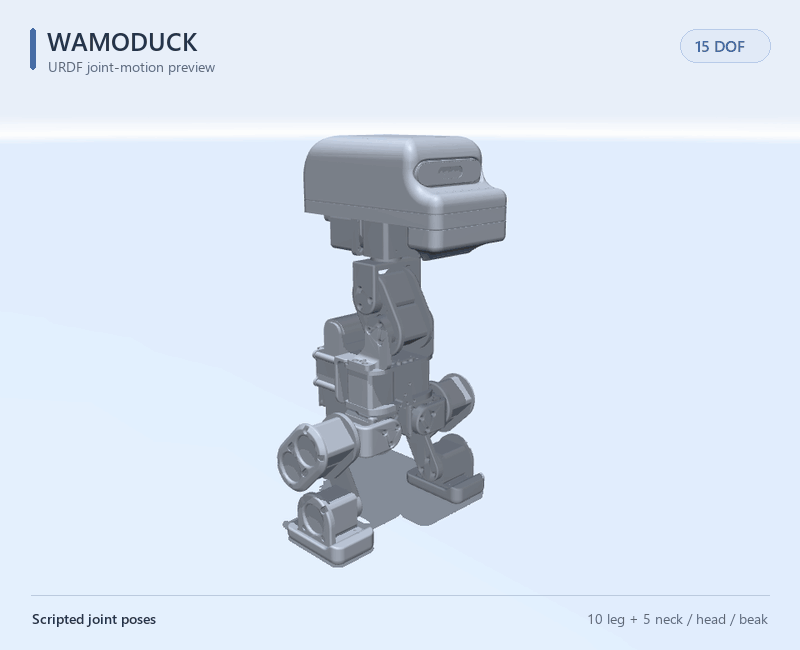
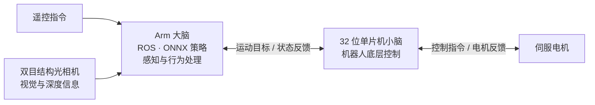
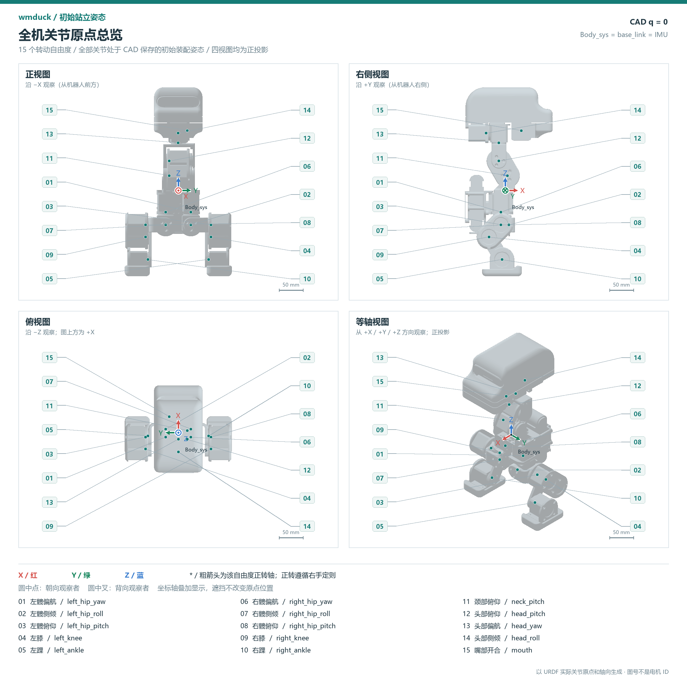
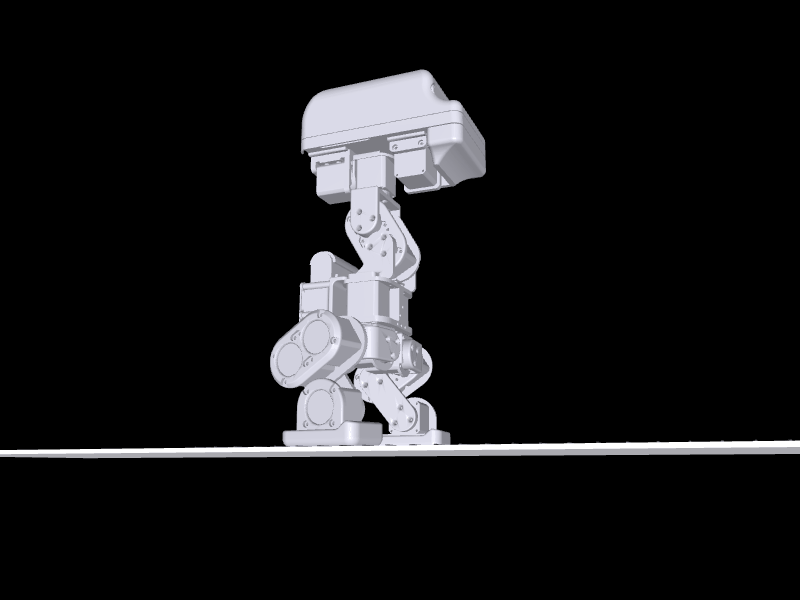

<p align="center">
  <a href="https://www.wamotechology.com">
    <picture>
      <source media="(prefers-color-scheme: dark)" srcset="assets/branding/wamotech-symbol-white.png">
      
    </picture>
    <br>
    <picture>
      <source media="(prefers-color-scheme: dark)" srcset="assets/branding/wamotech-wordmark-white.png">
      
    </picture>
  </a>
</p>

# Wamoduck

**从一只鸭子出发，探索运动、感知与自主行为。**

[English](README.md) | 简体中文



*动图由 Wamoduck URDF 渲染，以预设关节动作展示结构运动；并非实机录像或 ONNX 策略运行结果。*

Wamoduck 是 **Wamotech 正在开发的 15 自由度开源双足鸭子机器人**。它把伺服反馈控制、MCU／Arm 分层计算架构、双目结构光视觉与可扩展机械结构结合在一起，希望为开发者提供一个可以研究、改造并持续迭代的实验平台：从让机器人动起来，到尝试自己的环境感知与交互方式。

**当前阶段：结构打样与软硬件联合调试。已完成 MuJoCo 环境仿真，实机集成与调试正在推进。**

## Wamoduck 的特点

| 特点 | 能带来什么 |
| --- | --- |
| **伺服电机闭环控制** | 通过电机反馈，让运动指令与实际执行形成闭环，为动作跟踪和实机调试提供依据。 |
| **“小脑”与“大脑”分工协作** | 基于 32 位单片机的机器人“小脑”负责底层控制；基于 Arm 架构的“大脑”支持运行 ROS 和 ONNX 策略推理，将电机控制与上层感知、行为处理分开组织。 |
| **本地视觉感知** | 结合双目结构光相机，获取视觉与深度信息，用于本地场景识别和空间建模。 |
| **可持续扩展的结构** | 机械设计为结构、传感器和外设的调整留出扩展空间，可随实验需求迭代，并配合计算平台和控制系统持续拓展。 |

### 系统架构



这套软硬件系统架构也正在**智能穿戴式机器人等项目中开展实验应用**，探索控制、感知与策略模块在不同机器人形态之间的复用。

## 开发进度

- **结构打样与实机联调：** 正在进行样机结构制作和软硬件联合调试。
- **MuJoCo 仿真：** 已完成仿真工作，支持将遥控指令与策略驱动的自主动作结合的 ONNX 部署方式，思路类似 [Microduck](https://github.com/pollen-robotics/microduck) 与 [microduck_rl](https://github.com/pollen-robotics/microduck_rl)。面向实机的集成与调试仍在推进。
- **已训练策略与实测结果（仿真）：** 已有六项训练出来的能力，可在内部菜单里逐项操作——站立抗扰、推倒恢复、随机躺姿起身、键盘行走、1 cm 越障、坐/站。2026-09-16 的最新实测：站立抗推临界 **40.5 N**；推倒→自己起身→站回标称的端到端接力 **5/5**；1 cm 地形存活 **79.7 %**；起身有 **64/64** 的环境最终站住，但"回到保存的标称姿态"这条严格口径仍是 **0/64**；侧移与原地转仍不可用。数字、产出它们的工具，以及"站稳"的判定口径见[实测能力清单](docs/capabilities.zh-CN.md)。
- **参考步态：** 已随模型公开一条针对本 URDF 的行走参考轨迹，并附带 MATLAB 回放器，见[在 MATLAB 里试走参考步态](#在-matlab-里试走参考步态)。它是规划结果，不属于上面那些训练策略。
- **3D 打印：** [站姿标定工装](hardware/fixtures/standing-zero/README.zh-CN.md)提供四个分件与 H2D PLA 工程；另有独立的 [160 mm A1 mini 展示模型](hardware/printable/wamoduck-a1mini-standing/README_打印说明.md)，可一体打印。
- **当前公开资料：** 仓库已包含简化 CAD、URDF 与网格、模型参数、参考步态与回放器，以及中英文文档。仿真／训练代码、ONNX 策略文件、上述实测结果背后的检查点及其评估工具、运行软件、电子系统和完整搭建教程尚未在本仓库提供。
- **持续更新：** 后续会随着项目推进，陆续更新结构版本、联调进展及软硬件资料，具体方向见[路线图](docs/roadmap.md)。

以上项目进展与仓库当前公开文件的范围有所不同。随附[验证记录](models/wmduck/validation.json)只覆盖本 URDF 包的结构与导入检查，不代表项目全部仿真或实机验证结果。


*被推倒后自己站回标称姿态 —— 这是 **MuJoCo 仿真**录屏，跑的是训练出来的 `stand_v3` 与 `getup_v18` 策略，不是实机录像。实测数字、测量口径与仍不可用的行为见[实测能力清单](docs/capabilities.zh-CN.md)／[英文版](docs/capabilities.md)；同一场次的全长录像见 [wamoduck-force-test-demo.mp4](assets/wamoduck-force-test-demo.mp4)。*

## 15 个自由度，从双足运动到头部表情

最终版 URDF 定义了 **15 个转动自由度 = 左腿 5 + 右腿 5 + 颈部／头部／嘴部 5**：

| 部位 | 自由度 | 关节顺序 |
| --- | ---: | --- |
| 左腿 | 5 | 髋偏航 → 髋侧倾 → 髋俯仰 → 膝关节 → 踝关节 |
| 右腿 | 5 | 髋偏航 → 髋侧倾 → 髋俯仰 → 膝关节 → 踝关节 |
| 颈部、头部与嘴部 | 5 | 颈部俯仰 → 头部俯仰 → 头部偏航 → 头部侧倾 → 嘴部开合 |

其中，颈部占 1 个自由度，头部占 3 个，嘴部占 1 个；双腿之外，还能通过点头、转头、侧倾和嘴部开合组合出更丰富的动作表达。

模型共有 **17 个 link**：16 个机械刚体与 1 个固定 IMU 参考 link。IMU 参考系不增加主动自由度。`q=0` 对应保存的站立初始姿态，保留弯腿与倾斜颈部，并非电机编码器零位。具体关节名、轴向和限位见[模型指南](docs/model.zh-CN.md)，动图生成方式见[演示说明](assets/README.md)。

<details>
<summary>展开查看 15 个关节原点的四视图</summary>



图中为最终版 URDF 在保存姿态 `q=0` 下的正投影视图。01–05 对应左腿，06–10 对应右腿，11 为颈部，12–14 为头部，15 为嘴部。编号是图册索引，不是电机 ID；红、绿、蓝分别表示 X、Y、Z 轴，具体关节名称见图内图例。

</details>

## 在 MATLAB 里试走参考步态



*参考准静态步态：给定 [tools/matlab/data/](tools/matlab/data/) 里的关节角、由公开 URDF 做前向运动学回放。它是规划结果，不是训练策略，也不是实物拍摄。*

本仓库随模型附带一条针对本 URDF 的行走参考轨迹，以及一个 MATLAB 回放器：

```matlab
cd <repo>              % 含 models/ 与 tools/ 的那一层目录
addpath('tools/matlab')
wamoduck_play          % 交互回放器
wamoduck_play(true)    % 无界面自检：单位、关节限位、脚底贴地
```

回放器可以逐帧步进、把 15 个关节的力矩与电机的额定／峰值能力画在一起，并给出逐关节的角度与力矩表。随附两份数据：一个稳态步态周期（2.0 s，可无缝循环）和整段 1 m 行走。

公开 CSV 包含模型计算的关节角与力矩估计，其中最大绝对力矩为 **2.50815 N·m**，出现在整段行走的右膝。回放器保留现有的快速自检。原始高采样率规划器及其 IK／动力学生成代码尚未包含在仓库中；可从 CSV 复核的指标与原规划报告结果的区别见[步态指南](docs/matlab.zh-CN.md)。

参考轨迹包含小幅交替抬脚，模型回放本身不能证明动态平衡。原规划分析指出模型的重心横移能力有限，且没有踝侧摆关节；分析口径与已知限制见[步态指南](docs/matlab.zh-CN.md)，这些数据不是实机测量结果。

## 从这里开始

| 你想做什么 | 对应入口 |
| --- | --- |
| 查看或修改单个机械零件 | [20 个 STEP 模型](hardware/step/) · [机械文件指南](docs/mechanical.zh-CN.md) |
| 打印整机站姿标定工装 | [四个分件与 H2D PLA 工程](hardware/fixtures/standing-zero/README.zh-CN.md) · [打印数量表](hardware/fixtures/standing-zero/print-parts.csv) |
| 打印小型固定展示模型 | [160 mm A1 mini 一体打印版](hardware/printable/wamoduck-a1mini-standing/README_打印说明.md) |
| 查看原生装配关系 | [SolidWorks 文件](hardware/solidworks/) · [打开方法](docs/mechanical.zh-CN.md#solidworks-装配体) |
| 查看整机和关节运动 | [URDF 与网格](models/wmduck/) · [模型指南](docs/model.zh-CN.md) |
| 看参考步态 / 在 MATLAB 里自己播 | [步态指南](docs/matlab.zh-CN.md) · [MATLAB 回放器](tools/matlab/) · [行走视频](assets/wamoduck-gait-walk.mp4) |
| 了解模型中包含的部件 | [组件清单](docs/components.md) |
| 看训练策略实际能做到什么、哪些还不行 | [实测能力清单](docs/capabilities.zh-CN.md) |
| 参与改进项目 | [贡献指南](CONTRIBUTING.md) · [路线图](docs/roadmap.md) |

打开装配体或 URDF 前，请下载或克隆整个仓库；这些文件需要配套的零件或网格文件。

## 模型概览

下表前七行描述所附模型，后四行是训练策略的**仿真实测**结果。

| 项目 | 当前模型 |
| --- | --- |
| 转动关节 | 15 个：左腿 5 + 右腿 5 + 颈部／头部／嘴部 5 |
| 机器人描述 | URDF；16 个机械刚体 link + 1 个固定 IMU 参考 link |
| 几何文件 | 20 个简化 STEP 零件模型；20 个 URDF 用 STL 网格 |
| 保存姿态下的模型近似包络 | 181.5 × 221.2 × 390.8 mm（X × Y × Z） |
| 模型估算质量 | 3.751 kg；基于 CAD 并采用实测电机质量，并非整机实测重量 |
| 头链占该质量的比例 | 1.654 kg = 44.1 %：从 `neck_pitch_link` 到 `mouth_link` |
| 模型单位 | m、kg、rad；STEP 文件声明的长度单位为 mm |
| 已训练策略（仿真） | 6 项：站立抗扰、推倒恢复、起身、键盘行走、1 cm 越障、坐／站 |
| 站立抗推临界（仿真） | 40.5 N：单次水平推 0.2 s 能把 64 个环境里至少一半推倒的最小力度（40 N 时倒 45.3 %） |
| 推倒 → 起身 → 标称站姿（仿真） | 5/5 次试验；"起身后没有再次摔倒" 4/5 |
| 1 cm 越障（仿真） | 0.3 m/s 指令下跑 12 s，存活 51/64（79.7 %）；平均速度是指令的 61 % |

质量和包络描述的是所附模型，并非经过实物验证的规格。使用惯量、电机参数或关节范围前，请先阅读[模型假设](docs/model.zh-CN.md)。最后四行是训练策略的仿真实测结果，测量于 2026-09-16 的内部研发环境，**不是实机数据**，也无法从本仓库复现。方法、工具与仍不可用的部分见[实测能力清单](docs/capabilities.zh-CN.md)。

## 本次包含什么

```text
Wamoduck/
├── hardware/
│   ├── step/             # 机器人结构与采购件参考，毫米单位
│   ├── solidworks/       # 简化原生零件与装配体
│   ├── robot-structure.csv # 几何分类与模型实例数量
│   ├── fixtures/standing-zero/ # 四个 STEP、四个打印 STL 与 H2D 工程
│   └── printable/        # 固定展示模型与 A1 mini 工程
├── models/wmduck/        # URDF、网格、关节数据与导入检查
├── tools/matlab/         # 参考步态数据与 MATLAB 回放器
├── assets/              # 模型预览图与步态预览
├── docs/                # 中英文指南：机械、模型、步态、实测能力、路线图
├── CONTRIBUTING.md
└── LICENSE
```

机器人 STEP 可用于跨软件交换几何，也可将选定的结构件导入切片。[制造分类表](hardware/robot-structure.csv)区分了结构件与仅供装配参考的电机、轴承和电子件。`models/wmduck/meshes/` 下的 STL 使用米单位，用于显示和碰撞建模；打印工装请使用[工装目录](hardware/fixtures/standing-zero/README.zh-CN.md)内的毫米单位 STL。关节限位来自单关节几何检查，不能保证组合动作不发生碰撞。

站姿工装已配套四个打印件、H2D PLA 双盘工程、六颗 M3 螺钉规格和试装标定说明，完成了数字几何检查，实际打印配合与重复定位精度仍待测量。完整可运行机器人的复现，还需要经过核对的采购 BOM、结构件制造要求、整机装配步骤、接线及控制软件。[路线图](docs/roadmap.md)列出了后续内容。

## 一起把这只鸭子做得更有趣

如果你对伺服控制、机器人感知、策略部署，或自己的机械改造方案感兴趣，欢迎 **Star 关注项目进展**，通过 Issue 交流想法，或提交 PR 参与改进。中英文贡献都欢迎，入口见[贡献指南](CONTRIBUTING.md)。

## 联系我们

- 邮箱：[business@wamotechology.com](mailto:business@wamotechology.com)
- 官网：[www.wamotechology.com](https://www.wamotechology.com)

## 参考项目与许可证

文档组织参考了 [Open Duck Mini](https://github.com/apirrone/Open_Duck_Mini) 和 [Pollen Robotics Microduck](https://github.com/pollen-robotics/microduck)：提供清晰的设计文件入口、说明模型假设，并分别组织搭建、运行和训练资料。具体来源与区别见[参考说明](docs/references.md)。

仓库保留现有 [MIT 许可证](LICENSE)，版权归属 © 2026 Wamotech。参考项目与第三方部件保留各自的许可证及相关权利；不应假定它们的尺寸、控制器或搭建教程可直接用于 Wamoduck。
