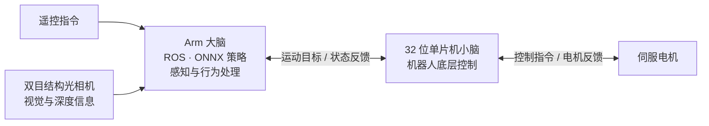

<p align="center">
  <a href="https://www.wamotechology.com">
    <picture>
      <source media="(prefers-color-scheme: dark)" srcset="assets/branding/wamotech-symbol-white.png">
      
    </picture>
    <br>
    <picture>
      <source media="(prefers-color-scheme: dark)" srcset="assets/branding/wamotech-wordmark-white.png">
      
    </picture>
  </a>
</p>

# Wamoduck

**从一只鸭子出发，探索运动、感知与自主行为。**

[English](README.md) | 简体中文


*动图由 Wamoduck URDF 渲染，以预设关节动作展示结构运动；并非实机录像或 ONNX 策略运行结果。*

## 这是什么

Wamoduck 是一只 **15 自由度的开源双足鸭子机器人**。望默科技做它，是想给运动、感知与自主行为的研究
留一个足够小、也足够好上手的实验平台。

项目目前处于**结构打样与软硬件联调**阶段：MuJoCo 仿真已经做完，实物还在装配和调试。

本仓库是这项工作的公开切片，给你四样东西：

- 机器人的 **CAD、URDF 和网格**；
- 一条**行走参考步态**，附带 MATLAB 回放器；
- **五个训练好的策略**，你大概五分钟就能自己跑起来；
- **站姿工装**和一个小型**展示模型**的打印文件。

> ### 引用这里任何内容之前，请先读这一段
>
> **本仓库里的所有结果都是仿真结果。** 仓库里没有任何实机数据，也没有任何一个策略在实物机器人上
> 测过。"在 MuJoCo 里能站住"不等于"在真机上能站住"。

**最快的入门方式**是直接跑策略：不需要 GPU、不需要训练框架，也不需要懂 MuJoCo。

## 它现在能做什么、还不能做什么

六项能力已经训练完成，并在 **2026-09-16** 于仿真中实测。其中五项以 ONNX 文件公开在本仓库，
你可以在自己的电脑上跑。

| 能做什么 | 策略 | 实测结果（仿真） |
| --- | --- | --- |
| 站住，并且扛住推一把 | `stand_v3` | 抗推临界 **40.5 N** —— 单次水平推 0.2 s 能把 64 个环境里至少一半推倒的最小力度。40 N 时倒 45.3 %，0–24 N 全不倒。 |
| 被推倒 → 自己起身 → 站回标称姿态 | `stand_v3` + `getup_v18` | 端到端 **5/5** 次试验。"起身后没有再次摔倒"：**4/5**。 |
| 从随机躺姿起身 | `getup_v18` | 末态站住 **64/64**（宽松口径）。 |
| 在平地上行走 | `walk_v4r` | 向前走可用。**侧移不可用**；**"原地转"是这台机构做不到的** —— 这是实测出来的极限，不是没训完的一轮。 |
| 在 1 cm 越障地形上行走 | `rough_v2` | 0.3 m/s 指令下跑 12 s，存活 **51/64（79.7 %）**。平均速度是指令的 **61 %**。 |
| 坐下再站起来 | `sit_stand_v2` | 可用高度指令交互控制。本批次没有验收数字。**两个已知问题：** 站立时会原地抖动；坐下时保持的姿态既不直立也不左右对称。 |

### 仍然不行的部分

- **原地转是这台机构做不到的，不只是"没训"。** 给 0.5 rad/s 的偏航指令，10 s 只转了 **+0.3°**。在纯 CPU 的 MuJoCo 上、两脚贴地实测：两个髋偏航关节是**内力矩对**，只能让躯干相对地面扭 **±30.5°**；而想卸载一只脚，质心需要横移 **60 mm**，这台设计只给得起 **38.5 mm** —— 而到那一步它已经倾了 **28.5°**，摔倒线是 **30°**。11 种两脚贴地的驱动方式都试过，没有一种能累积。用公开的行走策略、走公开运行器实测：在 0.20 m/s **以下它根本不会走**（0.10–0.15 m/s 时 10 s 只移动 0.012–0.018 m），而 0.20 m/s 以上它是**边走边转** —— 在 0.20 / 0.30 / 0.40 m/s 下分别跟踪到 0.5 rad/s 指令的 62 % / 69 % / 75 %，走的是实测半径 0.72 / 0.93 / 1.11 m 的弧线。能力清单因此把交付口径改写为"**行进中转向（实测最紧弧线 R ≈ 0.7 m，要求 vx ≥ 0.20 m/s）**"，并把真正的原地转列为**硬件改动** —— 见[为什么"原地转"不是训练能解决的](docs/capabilities.zh-CN.md#为什么原地转不是训练能解决的)。
- **侧移会把机器人带得打转。** 给 +0.30 m/s 的横移指令，实测 +0.218 m/s 的横移，同时伴随
  **+520.4°** 的未指令自转。我们自己的 CPU 复核也看到了它的缩小版：直行 5 s 期间侧向漂移了 **0.328 m**。
- **起身回不到保存的标称姿态。** 它能起来、也能站住 —— 64/64 —— 但"回到保存的标称姿态"这条严格
  口径仍然是 **0/64**。剩下的偏差集中在头链的第二段。
- **坐／站有两个用户报告的问题，都已实测、都尚未修复。** 切到 `sitstand`，机器人**站立时会原地抖动**：
  0.175 m 指令下每控制步的动作抖动 `mean abs(delta a)` 是 **0.235**，同一指标 `stand` 是 **2.9e-7**；
  关节速度绝对值均值 **1.69 rad/s**，而且不衰减。让它**坐下**（0.085 m）时保持的姿态是 **25.89°** 的
  倾斜 —— 头偏离竖直 **25.62°** —— 基座高度 **0.0943 m** 而不是 0.085 m，还有一部分体重压在它自己的
  骨盆上；五对腿关节里三对的左右值分处零的两侧（残差 **119°** 到 **174°**）。在
  [仿真指南](docs/simulation.zh-CN.md#sitstand-细看用户报告的两个问题)里跑那两条命令，得到的就是这些数字。
- **完全没有实机数据。** 本仓库里的任何数字都不是在实物机器人上测的。

这些是我们宁愿自己先说出来、也不想让你踩到的部分。完整的测量口径、产出每个数字的工具、以及"站稳"
到底怎么判定，都在[实测能力清单](docs/capabilities.zh-CN.md)／[英文版](docs/capabilities.md)上。

## 5 分钟上手

```bash
pip install mujoco onnxruntime numpy

git clone <本仓库>
cd Wamoduck
python wamoduck_sim.py
```

会打开一个窗口，五个策略都在里面。按数字键切换：

| 按键 | 策略 | 你应该看到什么 |
| --- | --- | --- |
| `1` | `stand` | 站着不动。用鼠标拖它一把，它会自己找回平衡。 |
| `2` | `getup` | 从躺在地上的姿态开始，然后站起来。 |
| `3` | `sitstand` | 按 `m` 蹲下去，再按一次站起来。 |
| `4` | `walk` | 方向键（或 `w` `a` `s` `d`）驱动它走；`e` 和 `z` 转向。 |
| `5` | `rough` | 同样的行走，脚下换成 1 cm 台阶。 |

运行器只依赖 `mujoco`、`onnxruntime`、`numpy` —— 不含 mjlab、torch，也不需要 CUDA。几个常用参数：

```bash
python wamoduck_sim.py --list                    # 看发布了什么
python wamoduck_sim.py --policy walk --vx 0.3    # 直接以 0.3 m/s 的行走启动
python wamoduck_sim.py --policy getup --spawn lie-back
python wamoduck_sim.py --policy stand --check    # 契约自检，不开窗口
```

**我们自己用这条公开代码路径在 CPU 上复核到的结果：**`stand` 在 5 s 内保持 **0.54°** 倾角与 1 mm
漂移 —— 连严格的"标称站姿"口径都通过；`getup` 能从公开的五个躺姿在 6 s 内站起来；`walk` 在 0.3 m/s
指令下走完指令 **1.500 m** 中的 **1.482 m**。

使用这些文件前，请先读[中文仿真指南](docs/simulation.zh-CN.md)／[英文版](docs/simulation.md)：
该页逐项写明观测布局与动作换算，说明为什么 ONNX 里已经含了观测归一化，说明为什么**必须**用随附的
MJCF 而不是 URDF，并列出已知的不足。

## 另外还有一条 ROS 2 的路

如果你不想碰物理引擎，[`ros2/`](ros2/README.zh-CN.md)是第二条入口。它是这台机器人的一套 ROS 2
**Jazzy** 链路：机器人描述能在 RViz 里打开，参考步态能作为 `sensor_msgs/JointState` 回放，46 字节
的部署协议带一份不依赖 ROS、且有单元测试的编解码器。

第 1 阶段（软件包）与第 2 阶段（RViz 可视化）已完成构建与验证。命令见
[中文 ROS 2 指南](ros2/README.zh-CN.md)／[英文版](ros2/README.md)。

**这条路没有声称的东西：**

| 范围 | 状态 |
| --- | --- |
| 机器 | 只在 **WSL2 Ubuntu 24.04、x86_64** 上验证过。没有在 RDK X5 的 ARM64 用户空间里构建或运行过，因此那边的可用性**未验证**。 |
| 硬件 | **未验证。** 没有串口、没有 CAN 总线、没有电机、没有 IMU。协议里的 `serial` 传输从未真正打开过。 |
| `policy_node` 端到端 | **未运行。** 它只是个骨架：只装配观测、从不做推理，因为 `onnxruntime` 没有安装。 |
| Gazebo 与 MoveIt | **未开始。** `ros2/` 里没有任何东西会跑 Gazebo。 |
| 物理 | RViz 不做积分、不施加重力，所以"画面上看起来像走路"完全没有证明动力学或平衡。**本项目的物理基准仍然是 MuJoCo。** |

## 其他探索方式

### 在 MATLAB 里试走参考步态


*参考准静态步态：给定 [tools/matlab/data/](tools/matlab/data/) 里的关节角、由公开 URDF 做前向运动学回放。它是规划结果，不是训练策略，也不是实物拍摄。*

本仓库随模型附带一条针对本 URDF 的行走参考轨迹，以及一个 MATLAB 回放器：

```matlab
cd <repo>              % 含 models/ 与 tools/ 的那一层目录
addpath('tools/matlab')
wamoduck_play          % 交互回放器
wamoduck_play(true)    % 无界面自检：单位、关节限位、脚底贴地
```

回放器可以逐帧步进、把 15 个关节的力矩与电机的额定／峰值能力画在一起，并给出逐关节的角度与力矩表。
随附两份数据：一个稳态步态周期（2.0 s，可无缝循环）和整段 1 m 行走。

公开 CSV 包含模型计算的关节角与力矩估计，其中最大绝对力矩为 **2.50815 N·m**，出现在整段行走的右膝。
原始高采样率规划器及其 IK／动力学生成代码尚未包含在仓库中；可从 CSV 复核的指标与原规划报告结果的
区别见[步态指南](docs/matlab.zh-CN.md)。

参考轨迹包含小幅交替抬脚，模型回放本身不能证明动态平衡。原规划分析指出模型的重心横移能力有限，
且没有踝侧摆关节；分析口径与已知限制见[步态指南](docs/matlab.zh-CN.md)。

### 打印点什么

- [站姿标定工装](hardware/fixtures/standing-zero/README.zh-CN.md)包含四个打印件、一个双盘 H2D PLA
  工程、六颗 M3 螺钉规格与试装标定说明。它的数字几何已经检查过；**实际打印配合与重复定位精度仍待测量**。
- [160 mm A1 mini 展示模型](hardware/printable/wamoduck-a1mini-standing/README_打印说明.md)是另一件
  独立的一体打印件。

### 打开 CAD 或模型

- [20 个简化 STEP 零件模型](hardware/step/)与[原生 SolidWorks 装配体](hardware/solidworks/)
  （[打开方法](docs/mechanical.zh-CN.md#solidworks-装配体)）。
- [URDF 与网格](models/wmduck/)，关节名、轴向和限位见[模型指南](docs/model.zh-CN.md)。
- [组件清单](docs/components.md)，说明模型里实际包含哪些部件。

打开装配体或 URDF 前，请下载或克隆整个仓库：这些文件需要配套的零件或网格文件。

### 接线

- 全部 15 个电机的 [CAN-FD 总线 ID](hardware/motor_ids.zh-CN.md)，附位置图、它们背后的三路总线，以及
  从策略动作向量到这些 ID 的置换。该页也直说：这个置换与总线拓扑**尚未**在实机上验证。

## 接下来去哪里

| 你想做什么 | 对应入口 |
| --- | --- |
| **自己在 MuJoCo 里跑训练好的策略** | [仿真指南](docs/simulation.zh-CN.md) · [ONNX 策略](policies/) · [`wamoduck_sim.py`](wamoduck_sim.py) |
| **用 ROS 2 而不是 MuJoCo** | [ROS 2 指南](ros2/README.zh-CN.md) |
| 看训练策略实际能做到什么、哪些还不行 | [实测能力清单](docs/capabilities.zh-CN.md) |
| 查看或修改单个机械零件 | [20 个 STEP 模型](hardware/step/) · [机械文件指南](docs/mechanical.zh-CN.md) |
| 打印整机站姿标定工装 | [四个分件与 H2D PLA 工程](hardware/fixtures/standing-zero/README.zh-CN.md) · [打印数量表](hardware/fixtures/standing-zero/print-parts.csv) |
| 打印小型固定展示模型 | [160 mm A1 mini 一体打印版](hardware/printable/wamoduck-a1mini-standing/README_打印说明.md) |
| 查 CAN-FD 总线 ID，或给三路总线接线 | [总线 ID 与位置图](hardware/motor_ids.zh-CN.md) |
| 查看原生装配关系 | [SolidWorks 文件](hardware/solidworks/) · [打开方法](docs/mechanical.zh-CN.md#solidworks-装配体) |
| 查看整机和关节运动 | [URDF 与网格](models/wmduck/) · [模型指南](docs/model.zh-CN.md) |
| 看参考步态 / 在 MATLAB 里自己播 | [步态指南](docs/matlab.zh-CN.md) · [MATLAB 回放器](tools/matlab/) · [行走视频](assets/wamoduck-gait-walk.mp4) |
| 了解模型中包含的部件 | [组件清单](docs/components.md) |
| 参与改进项目 | [贡献指南](CONTRIBUTING.md) · [路线图](docs/roadmap.md) |

## 这只机器人本身

| 特点 | 能带来什么 |
| --- | --- |
| **伺服电机闭环控制** | 通过电机反馈，让运动指令与实际执行形成闭环，为动作跟踪和实机调试提供依据。 |
| **“小脑”与“大脑”分工协作** | 基于 32 位单片机的机器人“小脑”负责底层控制；基于 Arm 架构的“大脑”支持运行 ROS 和 ONNX 策略推理，将电机控制与上层感知、行为处理分开组织。 |
| **本地视觉感知** | 结合双目结构光相机，获取视觉与深度信息，用于本地场景识别和空间建模。 |
| **可持续扩展的结构** | 机械设计为结构、传感器和外设的调整留出扩展空间，可随实验需求迭代，并配合计算平台和控制系统持续拓展。 |

### 系统架构



这套软硬件系统架构也正在**智能穿戴式机器人等项目中开展实验应用**，探索控制、感知与策略模块在不同机器人形态之间的复用。

### 15 个自由度，从双足运动到头部表情

最终版 URDF 定义了 **15 个转动自由度 = 左腿 5 + 右腿 5 + 颈部／头部／嘴部 5**：

| 部位 | 自由度 | 关节顺序 |
| --- | ---: | --- |
| 左腿 | 5 | 髋偏航 → 髋侧倾 → 髋俯仰 → 膝关节 → 踝关节 |
| 右腿 | 5 | 髋偏航 → 髋侧倾 → 髋俯仰 → 膝关节 → 踝关节 |
| 颈部、头部与嘴部 | 5 | 颈部俯仰 → 头部俯仰 → 头部偏航 → 头部侧倾 → 嘴部开合 |

其中，颈部占 1 个自由度，头部占 3 个，嘴部占 1 个；双腿之外，还能通过点头、转头、侧倾和嘴部开合组合出更丰富的动作表达。

模型共有 **17 个 link**：16 个机械刚体与 1 个固定 IMU 参考 link。IMU 参考系不增加主动自由度。`q=0` 对应保存的站立初始姿态，保留弯腿与倾斜颈部，并非电机编码器零位。具体关节名、轴向和限位见[模型指南](docs/model.zh-CN.md)，动图生成方式见[演示说明](assets/README.md)。

<details>
<summary>展开查看 15 个关节原点的四视图</summary>


图中为最终版 URDF 在保存姿态 `q=0` 下的正投影视图。01–05 对应左腿，06–10 对应右腿，11 为颈部，12–14 为头部，15 为嘴部。编号是图册索引，不是电机 ID；红、绿、蓝分别表示 X、Y、Z 轴，具体关节名称见图内图例。

</details>

## 模型概览

| 项目 | 当前模型 |
| --- | --- |
| 转动关节 | 15 个：左腿 5 + 右腿 5 + 颈部／头部／嘴部 5 |
| 机器人描述 | URDF；16 个机械刚体 link + 1 个固定 IMU 参考 link |
| 几何文件 | 20 个简化 STEP 零件模型；20 个 URDF 用 STL 网格 |
| 保存姿态下的模型近似包络 | 181.5 × 221.2 × 390.8 mm（X × Y × Z） |
| 模型估算质量 | 3.751 kg；基于 CAD 并采用实测电机质量，并非整机实测重量 |
| 头链占该质量的比例 | 1.654 kg = 44.1 %：从 `neck_pitch_link` 到 `mouth_link` |
| 模型单位 | m、kg、rad；STEP 文件声明的长度单位为 mm |

质量和包络描述的是所附模型，并非经过实物验证的规格。使用惯量、电机参数或关节范围前，请先阅读[模型假设](docs/model.zh-CN.md)。

本页上方那张行为表是另一类数字：那些行是训练策略的**仿真实测**结果，测量于 2026-09-16 的内部研发
环境，**不是实机数据**。其中五项策略现已随运行器公开，因此它们的行为可以在本仓库里以仿真方式重跑 ——
具体哪些能复现、哪些不能，见[仿真指南](docs/simulation.zh-CN.md) —— 但内部的测量协议与工具仍未公开。
方法、工具与仍不可用的部分见[实测能力清单](docs/capabilities.zh-CN.md)。

随附[验证记录](models/wmduck/validation.json)只覆盖本 URDF 包的结构与导入检查，既不代表项目的仿真
验证结果，也不代表实机验证结果。

## 本次包含什么

```text
Wamoduck/
├── hardware/
│   ├── step/             # 机器人结构与采购件参考，毫米单位
│   ├── solidworks/       # 简化原生零件与装配体
│   ├── robot-structure.csv # 几何分类与模型实例数量
│   ├── motor_ids.md      # CAN-FD 总线 ID、三路总线与动作置换
│   ├── fixtures/standing-zero/ # 4 个 STEP、4 个打印 STL 与 H2D 工程
│   └── printable/        # 固定展示模型与 A1 mini 工程
├── models/wmduck/        # URDF、网格、关节数据与导入检查
│   └── mjcf/             # 策略训练时用的 MJCF 模型
├── policies/             # 五个训练好的 ONNX 策略
├── wamoduck_sim.py       # 单文件 CPU 运行器：一个 demo 跑五个策略（mujoco + onnxruntime + numpy）
├── ros2/                 # ROS 2 Jazzy 链路：描述、节点、RViz、46 字节协议
├── tools/matlab/         # 参考步态数据与 MATLAB 回放器
├── assets/              # 模型预览图、步态预览与电机 ID 位置图
├── docs/                # 中英文指南：机械、模型、步态、仿真、实测能力、路线图
├── CONTRIBUTING.md
└── LICENSE
```

机器人 STEP 可用于跨软件交换几何，也可将选定的结构件导入切片。[制造分类表](hardware/robot-structure.csv)区分了结构件与仅供装配参考的电机、轴承和电子件。`models/wmduck/meshes/` 下的 STL 使用米单位，用于显示和碰撞建模；打印工装请使用[工装目录](hardware/fixtures/standing-zero/README.zh-CN.md)内的毫米单位 STL。关节限位来自单关节几何检查，不能保证组合动作不发生碰撞。

## 本仓库目前还没有的内容

仿真与训练代码、上述实测结果背后的检查点及其评估工具、运行软件、电子系统，以及完整的搭建教程，
都**还没有**在这里公开。经过核对的采购 BOM、结构件制造要求、整机装配步骤、接线图与控制软件同样没有。

一台能跑起来的完整机器人需要以上全部内容。[路线图](docs/roadmap.md)把它们列成了待交付项。

## 一起把这只鸭子做得更有趣

如果你对伺服控制、机器人感知、策略部署，或自己的机械改造方案感兴趣，欢迎 **Star 关注项目进展**，通过 Issue 交流想法，或提交 PR 参与改进。中英文贡献都欢迎，入口见[贡献指南](CONTRIBUTING.md)。

后续会随着项目推进，陆续更新结构版本、联调进展及软硬件资料，具体方向见[路线图](docs/roadmap.md)。

## 联系我们

- 邮箱：[business@wamotechology.com](mailto:business@wamotechology.com)
- 官网：[www.wamotechology.com](https://www.wamotechology.com)

## 参考项目与许可证

文档组织参考了 [Open Duck Mini](https://github.com/apirrone/Open_Duck_Mini) 和 [Pollen Robotics Microduck](https://github.com/pollen-robotics/microduck)：提供清晰的设计文件入口、说明模型假设，并分别组织搭建、运行和训练资料。ONNX 部署思路与 [Microduck](https://github.com/pollen-robotics/microduck) 及 [microduck_rl](https://github.com/pollen-robotics/microduck_rl) 相近。具体来源与区别见[参考说明](docs/references.md)。

仓库保留现有 [MIT 许可证](LICENSE)，版权归属 © 2026 Wamotech。参考项目与第三方部件保留各自的许可证及相关权利；不应假定它们的尺寸、控制器或搭建教程可直接用于 Wamoduck。
