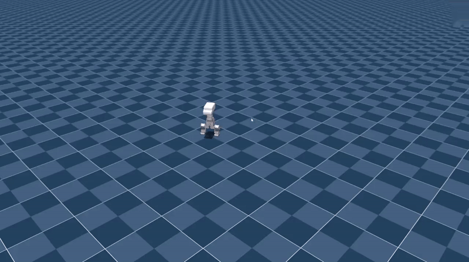
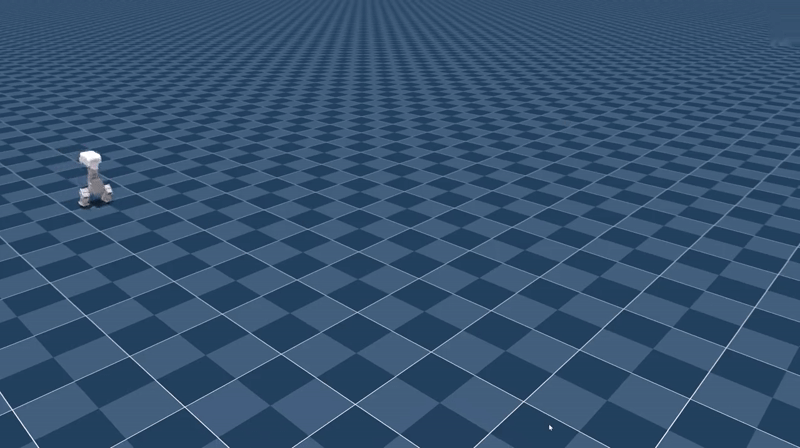
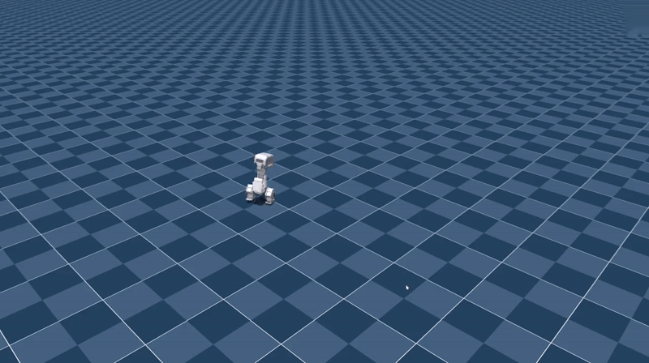

# 实测能力清单 / Measured capabilities

[中文首页](../README.zh-CN.md) · 简体中文 | [English](capabilities.md) · [仿真指南](simulation.zh-CN.md) · [路线图](roadmap.md)

本页是一张**诚实的能力总览**：训练出来的策略到底能做到什么。下面每个数字都是 **2026-09-16** 在仿真里实测的，逐条抄自测量日志，并在旁边标出产出它的工具。这里没有任何外推、估算，也没有把别的轮次的结果不作说明地搬过来；**做不到的部分与做得到的部分同等列出**。

**范围：只有仿真。** 策略跑在单台笔记本 GPU 上的 MuJoCo / mjlab 环境里，每次测量通常用 **64 个并行环境**（行走那张表用 32 个），轮次在每一行里标出。本页没有任何实机数据。训练代码、场景生成器、检查点与测量工具都在内部研发仓库里，**不在本仓库**，所以本页是**测量报告，不是复现配方**。引用之前请自己重测。

**其中五项策略现已公开**为 ONNX 文件，并随附它们训练时用的 MJCF 与一个 CPU 运行器 —— 因此它们的行为可以重跑，但下面这些数字背后的**测量协议仍然不能复现**。观测与动作契约、关节顺序、我们自己 CPU 复核的结果，以及仍然不可用的部分，见[在 MuJoCo 里跑训练好的策略](simulation.zh-CN.md)／[英文版](simulation.md)。

## 总览

| # | 能力 | 策略 | 结论性数字 |
| --- | --- | --- | --- |
| 1 | 站立抗扰 | `stand_v3`（`model_1499.pt`，已 SHIP） | 抗推临界 **40.5 N**；40 s 稳态漂移 **0.00 mm/s** |
| 2 | 推倒 → 自己起身 → 站回标称 | `stand_v3` + `getup_v18`（`model_3999.pt`） | **5/5** 次试验末态落在严格标称站姿 |
| 3 | 随机躺姿起身 | `getup_v18`（`model_3999.pt`） | 末态站住 **64/64**；严格标称口径仍 **0/64** |
| 4 | 平地行走 | `walk_r3`（`model_5999.pt`，已 SHIP） | 直行跟踪 106 %／103 %，但**侧移与原地转是坏的** |
| 5 | 1 cm 越障 | `rough_v2`（`model_5999.pt`） | 存活 **51/64（79.7 %）**；平均速度是**指令的 61 %** |
| 6 | 坐 / 站 | `sit_stand_v2`（`model_2499.pt`，已 SHIP） | 交互式高度控制；本轮没有验收数字 |

标着**已 SHIP**的策略，是内部演示默认加载的那个检查点。本次发布起，六行里有五行也提供了可以直接跑的公开 ONNX：`stand_v3`、`getup_v18`、`sit_stand_v2`、`rough_v2` 与本页写的检查点完全一致；而公开的行走策略是 `walk_v4r`，**不是**本页实测的 `walk_r3` —— 见[第 4 节](#4-平地行走)与[仿真指南](simulation.zh-CN.md)。

## 1. 站立抗扰

| 项目 | 内容 |
| --- | --- |
| 策略 | `stand_v3`，`model_1499.pt`（已 SHIP） |
| 实测 | 鼠标拖拽施力，它自己找回平衡。40 s 安静站立：基座净位移速率 **0.00 mm/s**、路径总长速率 **0.00 mm/s**、动作抖动 **平均 abs(Δa) = 0.00000** |
| 推力协议 | 单次水平推 0.2 s、定幅、方位角逐环境随机、施力点在质心上方 0.05 m 且**力臂力矩照算**；全程闭环跑策略；判"倒"= 倾角 > 60° 或基座高度 < 0.10 m |
| 实测阈值 | 0 至 24 N：**0/64** 倒。32 N：1.6 %。40 N：**45.3 %**。48 N：89.1 %。56 N：96.9 %。临界力（摔倒率首次 ≥ 50 % 的最小力度）= **40.5 N** |
| 工具 | `diagnose_stand_play.py`（40 s 稳态）、`measure_push_threshold.py`（64 环境） |

*平常推一把：没倒。仿真录屏，不是实机录像：画面是 MuJoCo 里跑站立策略 `stand_v3`，属于挑选出来的单次片段，不是测试。*

这份测量里有两条值得照抄的纪律。第一，训练侧的扰动与测量侧的推力必须是**同一个物理量** —— 水平、定幅、方位角随机、力臂力矩照算；此前两边口径不一致时，量出来的"阈值"只是看起来像实测。第二，每张扫描表都**强制先跑 0 N 对照组**：不施力都站不住，就直接判"协议无效"，而不是给出一个临界力。正是这条对照组抓出了这个工具的第一个版本 —— 它用零动作步进、策略根本没进回路，于是得出"8 N 就能推倒 100 %"的假结论。

## 2. 推倒 → 自己起身 → 站回标称

| 项目 | 内容 |
| --- | --- |
| 策略 | `stand_v3` + `getup_v18`（`model_3999.pt`），由一个小的状态机自动接力 |
| 过程 | 推倒 → 自动换成起身策略 → 自己站起来 → 换回站立策略并收到保存的标称姿态 |
| 实测（5 次试验） | 端到端、且末态落在严格标称站姿：**5/5**。末态倾角 **0.5°**、`neck_pitch` **0.3°**、逐关节最大偏差 **1.9°**、双脚着地、基座高 **0.177 m** —— 五次试验这五个数字完全相同 |
| 还不够好的地方 | "起身后没有再次摔倒"：**4/5**。有一次试验里接力摔了五次，最后末态才通过 —— 说明这个接力还不是强意义上的可重复 |
| 工具 | `probe_recovery_handover.py --trials 5` |

*被推倒后自己站回标称姿态。仿真录屏，不是实机录像：画面是 MuJoCo 里 `stand_v3` 与 `getup_v18` 的接力，属于挑选出来的单次片段 —— 上面的 5/5 与 4/5 来自那次 5 次试验的探针，不是来自这段动图。*

*最剧烈的一段：连续尝试、最终成功起身。仿真录屏，不是实机录像：画面是 MuJoCo 里的 `getup_v18`。之所以把它放出来，恰恰因为它不是一次干净的示范 —— 前几次尝试失败之后才起身，这与上面"起身后没有再次摔倒 4/5"那一行是一致的。*

这场次的全长录像 —— 推、推倒、反复起身尝试与接力，1:49.37、1280 × 716、无音轨 —— 见 [wamoduck-force-test-demo.mp4](../assets/wamoduck-force-test-demo.mp4)。它只是**一次场次，不是一轮测试**；本页的比例数字来自每一行里写明的工具。

这一条最重要，因为它是唯一**把两个策略放在一起**测的判据：末态姿态达标、却过不了接力，就不是可用的机器人行为。

## 3. 随机躺姿起身

| 项目 | 内容 |
| --- | --- |
| 策略 | `getup_v18`，`model_3999.pt` |
| 设置 | 随机横滚／俯仰躺姿出生，64 环境，300 步（6 s） |
| 实测 | 中途站起过 **64/64**；末态站住 **64/64**（松口径：倾角 < 30° 且基座高度 > 0.15 m）；首次站起用时中位 **0.50 s**、p90 **0.81 s**；末态倾角均值 **7.8°** |
| 严格口径 | 是否回到**标称**站姿（倾角 < 8°、双脚着地、每关节偏差 < 20°）：**0/64**。逐关节最大偏差均值 52.3°，双脚着地 63/64 |
| 900 步交付口径 | 起身交付口径跑 900 步，要求判据**持续**成立而不是某一刻碰巧成立：仍是 **0/64**。卡住的关节换成了 `head_pitch` **46°** —— 头链的**第二段**，而它并不碰地 |
| 头链触地 | **0/64**，即头不再承担整机重量。上一轮是 63/64，头受到的地面反力 **17.5 N**，约等于头自重的 106 % |
| 工具 | `eval_getup.py --envs 64`、`check_getup_delivery.py --envs 64`、`probe_getup_support.py` |

两段要合起来读：机器人**能**稳定起来、也**能**稳定落到站立姿态；但它还不能稳定落进**保存的标称姿态**。缺口集中在一个头链关节上，而不是分摊在两条腿上，训练侧正在改。

## 4. 平地行走

这一行要格外小心读，因为**数字与策略不是同一轮**。

| 项目 | 内容 |
| --- | --- |
| 已 SHIP 的策略 | `walk_r3`，`model_5999.pt`，训练于 2026-09-12，用的是**旧的命令范围** |
| 最新的同协议表 | `walk_v3`，`model_5999.pt`（2026-09-15/16，**未发布**），体坐标系指令，32 环境，500 步（10 s） |
| 直行跟踪 | 指令 0.3 m/s → **106 %**；指令 0.5 m/s → **103 %** |
| 侧移 | 指令 +0.30 m/s → 体坐标系实测 **+0.218 m/s**，但同样的 10 s 里出现 **+520.4°** 的未指令自转，以及 **−0.003 m** 的前进漂移。侧移的**量**还在（上一轮实测 +0.240 m/s），塌掉的是"不转"这条纪律 ⇒ 这个模式**不可用** |
| 原地转 | 指令 0.5 rad/s → 只做到指令偏航的 **0.1 %**，也就是 10 s 转了 **+0.3°**。它不会原地转 |
| 边走边转 | 0.4 m/s 加 0.5 rad/s → 前进 **109 %**、偏航 **7 %** |
| 工具 | `measure_twist_tracking.py --run walk_v3` |

两条提醒，说的都是诚实而不是能力：

- 已 SHIP 的 `walk_r3` 检查点训练时用的命令范围与当前配置不同，所以**拿当前口径测它、和这张新表不能直接比**。它的表现最好用交互式键盘演示去感受，而不是引用任何一张表。行走此后已重训：`walk_v4r` 于 2026-09-16 跑到迭代上限 6000，**它最终的检查点 `model_6000.pt` 就是本仓库公开的那个行走策略** —— 那份 ONNX **不是**本表实测的那个检查点。
- 这一轮**换了尺子**。旧判据用世界系净位移，它分不清"不会走"和"走了一个整圆"；上表的数字都是**体坐标系**积分 —— 与训练奖励用的是同一个量 —— 而且这个工具在测任何东西之前，先用解析轨迹证明了自己这把尺子。

我们自己对公开的 `walk_v4r` 策略做的 CPU 复核（走公开的[仿真运行器](simulation.zh-CN.md)）与上面两条失败是一致的：在 +0.30 m/s 的前进指令下，5 s 走完指令 1.500 m 中的 **1.482 m** 且没有摔倒，但被要求直行时侧向漂了 **0.328 m**。那是在纯 CPU MuJoCo 上的 Sim2Sim 检查，**不是**对这张表的重新测量，两者不可比。

## 5. 1 cm 越障

| 项目 | 内容 |
| --- | --- |
| 策略 | `rough_v2`，`model_5999.pt` |
| 设置 | 生成地形，含 1 cm 坎与 1 cm 落差，难度行 0 到 5；64 环境，600 步（12 s），前进指令 +0.30 m/s；关掉课程，使难度行不会在测量中途改变 |
| 实测 | 存活到结束 **51/64（79.7 %）**；平均前进速度 **+0.183 m/s = 指令的 61 %**；前进超过 0.1 m 的有 **53/64**；最大倾角中位／p90 **7.7 / 8.3°** |
| 只看硬地形 | 难度行 ≥ 3（n = 33）：存活 **24/33**，平均速度 **+0.157 m/s** |
| 工具 | `eval_rough.py --envs 64`（轮次 `rough_v2`） |

61 % 是实打实的掉速，而且它是相对**指令**速度算的，不是相对策略的平地速度。**同一批里没有跑平地对照组**，所以本页不把掉速单独归因给地形。

## 6. 坐 / 站

| 项目 | 内容 |
| --- | --- |
| 策略 | `sit_stand_v2`，`model_2499.pt`（已 SHIP） |
| 操作 | 一个键切换坐／站，另两个键升降目标高度 |
| 实测 | 只有交互式演示。同一批里这一轮没有记录验收数字，所以这里也不声称任何数字 |
| 工具 | `play_sit_stand.py`、`diagnose_stand_play.py` |

## "站稳"的判定口径

四条阈值，必须**同时**成立才算"回到标称站姿"：

1. 倾角 < **8°** —— 是直立，而不只是"还没摔倒"；
2. **双脚着地** —— 是站着，而不是靠膝盖、肩膀或头撑住；
3. 每个关节偏差 < **20°**（标称 = 全零）；
4. 基座高度 > **0.15 m** —— 不是蹲着。

四条之外还有一条**持续规则**：判据必须在**末 1.0 s 里至少 90 % 的时刻**成立（50 Hz 下的 50 个控制步）。它刻意既不取"每一帧"，也不取"最后一帧"。

为什么是 90 %：站着的机器人一直在微调，就像人在公交车上保持平衡。要求连续 50 步一帧不差，等于要求它像雕塑一样不动 —— 在同一批末态上，"双脚着地"这条按"每一帧"算给 **20/64**，只按"最后一帧"算给 **63 到 64/64**。90 % 落在两者之间：既不接受"某一帧碰巧对了"，也不再否掉一个正在主动平衡的机器人。

用来描述"站着"的那对**松口径**（倾角 < 30°、基座高度 > 0.15 m）是刻意保留、单独命名的：把两套口径混为一谈，曾经让一个停在 19° 歪姿上的策略被报成"已恢复"。

起身交付口径在同四条之外再加两条，因为光凭四条会放过"头一直压在地上、脚踩在一条棱上"的姿态：**头链不压地**（竖直地面反力低于 2 N，与训练惩罚用的是同一个阈值），以及**双脚平贴**（偏差 < 5°）。整套阈值只有一份定义，放在 `stand_criteria.py` 里，由评估工具、起身演示和接力探针共同 import —— 所以是全项目一套阈值，而不是每个脚本各写一套。

## 这些结果背后的两条结构性事实

**头部占整机 44 %。** 头链 —— `neck_pitch_link`、`head_pitch_link`、`head_yaw_link`、`head_roll_link`、`mouth_link` —— 占模型总质量 **3.751 kg** 中的 **1.654 kg**，即 **44.1 %**。这两个数都能直接从公开的 [URDF](../models/wmduck/wmduck.urdf) 与[质量台账](../models/wmduck/component_mass_audit.csv)读出来。

**头部是一个双向杠杆。** 训练模型里，绕 `neck_pitch` 轴的**最大静态重力矩**是 **1.61 N·m**（闭式解），而在保存的标称站姿下这个关节只需要约 **0.05 N·m** —— 标称姿态几乎说明不了最坏角度。只要执行器上限小于那个最大值，就必然存在一段角度带：重力能把头折下去，而这个关节**抬不回来**（单向棘轮）。在其余关节统一使用的 1.5 N·m 上限下，这段死区宽约 **139°**；这正是训练模型把这**一个关节**放宽到 **2.2 N·m** 的原因（= 最大静态重力矩的 1.37 倍、记录到的堵转力矩的 59 %），而且只改带碰撞的那个变体。一次起身回放中脖子力矩峰值 **1.613 N·m**，相对 2.2 N·m 的上限余量 **27 %**、贴限时刻 **0 %**。

这句话有两点**不**意味着。它不是硬件额定值：2.2 N·m 是电机额定连续输出的 3.7 倍、记录到的堵转力矩的 59 %，且只允许用于收头这类短暂过程。它也不是对公开模型的陈述：[URDF](../models/wmduck/wmduck.urdf) 的 effort 列对 15 个关节一律保留额定的 0.6 N·m，而且根本不声明任何执行器 —— 所以本仓库里没有任何地方写着 2.2 N·m 这个上限。把同一个闭式解在**公开** URDF 上重算一遍（把头链每个刚体的重量乘其绕轴的力臂求和，并对关节转角取最大值）得到 **1.574 N·m**，原因是训练模型带着尚未公开的实测质量更新。

## 本页不声称什么

- **没有实机结果。** 每个数字都是仿真。实物的质量、摩擦、柔性和传感器链路都不在这些数字里。
- **无法从本仓库复现。** 场景、测量协议与测量工具都是内部的。其中五项策略现已作为 ONNX 文件连同 CPU 运行器公开（见[仿真指南](simulation.zh-CN.md)），所以你可以重跑它们的**行为**；但本页是测量报告，上面的数字来自另一个仿真器与一套未公开的协议。
- **没有感知、热或耐久结果。** 本页不涉及相机、运行软件、占空比或长时间可靠性。
- **起身的严格口径没达标**（0/64），**行走的侧移与原地转不能用**。这些是待办项，不是舍入误差。
- **训练模型不是公开模型。** 这些结果描述的是训练用的仿真模型，它目前在实测质量更新上与公开 URDF 有差异。

文档还刻意留白的地方，都记在[路线图](roadmap.md)里。
