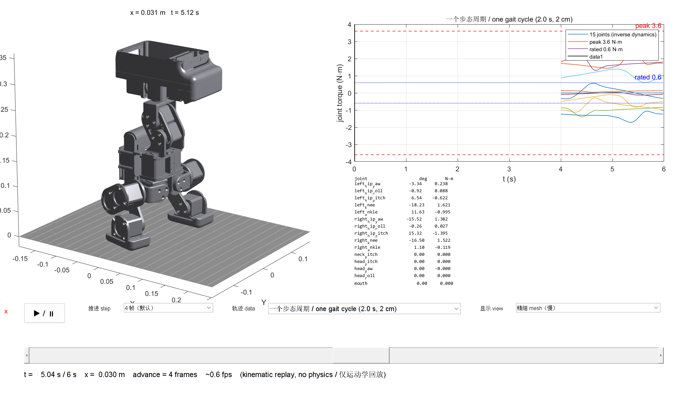

# Reference gait and MATLAB player / 参考步态与 MATLAB 回放

[English home](../README.md) · [中文首页](../README.zh-CN.md) · [中文版](matlab.zh-CN.md) · [Player README](../tools/matlab/README.md)

This page documents the bundled reference gait: where the data comes from, what it is and is not, how to play it, and the measured limits of this leg design.

```matlab
cd <repo>                      % the folder containing models/ and tools/
addpath('tools/matlab')
wamoduck_play                  % interactive player
wamoduck_play('mesh')          % start in the full-mesh view
wamoduck_play(true)            % headless self-test: units, limits, ground contact
```



## What is included

| Item | Contents |
| --- | --- |
| [`tools/matlab/wamoduck_play.m`](../tools/matlab/wamoduck_play.m) | Interactive player: play/pause, advance step, two data sets, skeleton or mesh view, torque plot, per-joint table |
| [`tools/matlab/data/gait_cycle_2s_50Hz.csv`](../tools/matlab/data/gait_cycle_2s_50Hz.csv) | One steady-state gait cycle: 100 frames at 50 Hz (2.0 s, 2 cm forward), seamless loop |
| [`tools/matlab/data/gait_walk_1m_10Hz.csv`](../tools/matlab/data/gait_walk_1m_10Hz.csv) | The full 1 m walk decimated to 10 Hz (104 s) |
| [`assets/wamoduck-gait-preview.gif`](../assets/wamoduck-gait-preview.gif) | Two cycles rendered from the public URDF with prescribed joint angles |
| [`assets/wamoduck-gait-walk.mp4`](../assets/wamoduck-gait-walk.mp4) | 20 s of continuous walking, with the body position shown |

## What the data is

The columns and units are listed in the [player README](../tools/matlab/README.md#data-format--数据格式). In short: 15 joint angles in **radians**, 15 inverse-dynamics torque estimates in **N·m**, and the body (`base_link`) pose in metres.

The plan is a **quasi-static gait** at 1 cm per step, 1 s per step, so the body advances 1 cm/s. Each cycle the body moves 2 cm and the two feet alternate; the foot lift is 4.5 mm.

Angles are in radians because the ship-and-replay path should contain no unit conversion at all. (An earlier internal viewer converted angles twice and rendered every joint 57× too large; that class of bug is easy to hide and hard to notice, so the public data avoids the conversion entirely.)

## What the gait does and does not do

Measured on the model this plan was made with, over the full 1 m walk:

| Quantity | Value | How it was obtained |
| --- | ---: | --- |
| Inverse-kinematics position error | 0.015 mm median, 0.020 mm max | Per-sample IK residual |
| Sole contact | within +0.04 / −0.12 mm of the ground plane | Lowest sole corner per frame, MuJoCo model |
| Static stability margin | positive for 100 % of samples (min +34.2 mm) | Centre of mass against the support polygon |
| Peak inverse-dynamics torque | 2.53 N·m (`right_knee`), 70 % of the 3.6 N·m peak rating | Per-joint inverse dynamics |
| Foot clearance while swinging | 4.5 mm, 21 % of the time above 1 mm | Lowest sole corner |
| Both feet stationary | 54 % of the time | Lowest sole corner |

The gait is a **double-support quasi-static shuffle**. Both soles stay within a few millimetres of the ground for most of the cycle; it is not a dynamic walk, and the bundled data does not claim to be one.

Two structural reasons, both measured rather than assumed:

- **A real single-support step is out of reach.** Lifting a foot more than ~5 mm leaves only the stance foot as support, and the centre of mass must then move over that foot: with a 165 mm stance and a 51 mm wide sole, that is a lateral shift of **at least 57 mm**. This leg has **no ankle-roll joint** and only about 15 mm of knee travel beyond the nominal pose, so that lateral shift is not kinematically available. Forcing it makes the inverse kinematics roll the foot onto its edge — a test variant reached a 42° foot roll, 6.3 mm of ground penetration and contact forces of 112 N against a 37 N robot weight.
- **The sole cannot be levelled laterally, only fore-aft.** Fore-aft tilt is fixed by the hip-pitch/knee/ankle chain; levelness there is achievable and is enforced (0.01° residual). Lateral tilt is set by the hip roll and the body roll, which have no independent ankle-roll to compensate them, so a few degrees of lateral sole tilt remain.

This is what gives the plan its shape: a 4.5 mm lift with a 30 % swing window keeps both soles effectively on the ground, which is what makes the static margin positive throughout.

## Playing it

| Control | Meaning |
| --- | --- |
| ▶ / ⏸ | Play or pause |
| 推进 step | How many data frames to advance per displayed frame; smaller is smoother. MATLAB cannot draw faster than roughly 1–5 fps here, so a small step is what makes the motion look continuous. |
| 轨迹 data | Switch between the single cycle and the full 1 m walk |
| 显示 view | **Skeleton** (fast, for watching motion) or **mesh** (real STL geometry, for inspecting a pose) |
| slider | Scrub to any frame |
| torque plot | All 15 joints with the 0.6 N·m rated and 3.6 N·m peak lines from [`motor_parameters.json`](../models/wmduck/motor_parameters.json) |

`wamoduck_play(true)` checks the data without opening a window: angles inside the URDF limits, and both soles on the ground plane.

## Provenance

The joint angles and body pose come from a quasi-static reference-gait plan computed with this repository's URDF (the plan was produced by a separate simulation project and exported here in radians). The GIF, the MP4 and the still frame are rendered from the public URDF by prescribing those joint angles and running forward kinematics — the same method described in [`assets/README.md`](../assets/README.md) for the joint-motion preview. No physics integration, no controller, no learned policy, no hardware.

Torques are inverse-dynamics estimates using the modelled masses and inertias in this repository, not measurements. They use the model with the maintainer-measured 141 g motor mass recorded in [`motor_parameters.json`](../models/wmduck/motor_parameters.json), so the shipped data and the shipped URDF describe the same robot. Treat them as a demand estimate for a given motor rating, not as a bench result.
