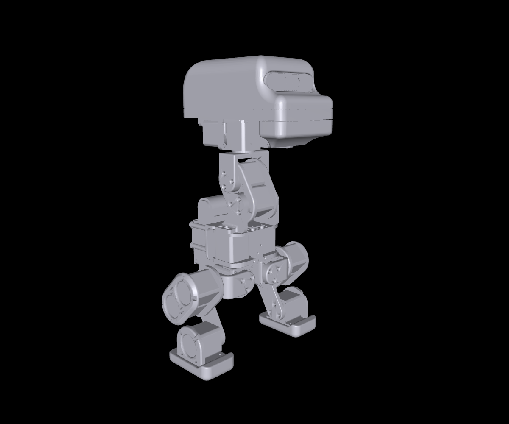

# Wamoduck model guide

[Home](../README.md) · English | [简体中文](model.zh-CN.md) · [Gait guide](matlab.en.md)

The [Wamoduck URDF](../models/wmduck/wmduck.urdf) describes a 15-DOF robot exported from the saved `Full_wmduck.SLDASM` assembly in SolidWorks 2025. It provides geometry, kinematics, estimated inertia, and joint limits for inspection and simulation development. This guide covers the public model snapshot. The project's completed MuJoCo simulation work and ongoing hardware/software integration are described on the [project homepage](../README.md); controller, training, and ONNX policy files are not yet included in this repository.

A walking reference plan computed with this URDF — one gait cycle and the full 1 m walk, with a MATLAB player — is documented in the [gait guide](matlab.en.md).



This is a rendering of the model, with a uniform gray appearance; it is not a photograph or a reproduction of all CAD colors.

## Package files

Keep [models/wmduck/](../models/wmduck/) together when copying the model.

| File | Purpose |
| --- | --- |
| [wmduck.urdf](../models/wmduck/wmduck.urdf) | Robot description, including inertial and joint data |
| [meshes/](../models/wmduck/meshes/) | 20 binary STL assets, reused across 40 component instances |
| [joint_parameters.json](../models/wmduck/joint_parameters.json) | Joint ranges in radians, effort in N·m, velocity in rad/s |
| [joint_limits.csv](../models/wmduck/joint_limits.csv) | Limits in degrees/radians, collision pairs, boundary brackets, and exceptions |
| [motor_parameters.json](../models/wmduck/motor_parameters.json) | Transcribed motor specifications and inertia estimation policy |
| [component_mass_audit.csv](../models/wmduck/component_mass_audit.csv) | Component materials, densities, and masses |
| [validation.json](../models/wmduck/validation.json) | Current package structure and MuJoCo import checks |

The JSON files describe the supplied export. **Editing JSON alone does not regenerate or change the URDF.** Update the URDF and matching parameter records together when revising values. The CAD extraction snapshots and generation scripts are outside this public package.

## Frames, units, and zero pose

- `base_link` coincides with the assembly's `Body_sys` IMU reference: +X forward, +Y left, +Z up.
- `imu_link` is a massless reference fixed to `base_link` with zero translation and rotation. It does not establish a calibrated physical IMU installation or add a simulated sensor.
- **Every joint at q=0 means the saved CAD pose**, including bent legs and an inclined neck. Encoder zero, motor direction, and a straight-leg reference require separate calibration.
- Joint origins come from the intersection of a concentric mate axis and its corresponding coincident mate plane. At zero, link axes are parallel to `Body_sys`; subassembly translations were not used directly as joint positions.
- Yaw rotates about +Z; roll about +X; pitch, knee, ankle, and mouth about +Y. Positive rotation follows the right-hand rule on both sides.
- Units are metres, kilograms, kg·m², and radians. **STL coordinates are already in metres and every mesh scale is `1 1 1`; do not apply a further 0.001 conversion.**

There are 17 links: 16 mechanical rigid bodies plus `imu_link`, connected by 15 revolute joints and one fixed joint. Internal subassembly parts move as rigid groups; motor rotor motion is not a separate DOF.

The names below identify the joints along each chain:

```text
base_link (Body_sys)
├─ left_hip_yaw → left_hip_roll → left_hip_pitch → left_knee → left_ankle
├─ right_hip_yaw → right_hip_roll → right_hip_pitch → right_knee → right_ankle
├─ neck_pitch → head_pitch → head_yaw → head_roll → mouth
└─ imu_link (fixed)
```

## Confirmed URDF joint limits

The finalized export retains the maintainer-confirmed settings for all 15 joints; the public URDF has the same joint definitions. All angles below are degrees relative to the saved pose. Their original basis remains conditional geometric estimates, not newly measured mechanical stops or encoder limits. SolidWorks angle mates position the saved assembly; they were not treated as physical travel limits.

| Joint | Lower (°) | Upper (°) | Basis / exception |
| --- | ---: | ---: | --- |
| `left_hip_yaw` | -99.0 | 30.5 | CAD interference, inward margin ≥2° |
| `right_hip_yaw` | -30.5 | 99.0 | CAD interference, inward margin ≥2° |
| `left_hip_roll` | -63.9 | 24.7 | CAD interference, inward margin ≥2° |
| `right_hip_roll` | -24.7 | 63.9 | CAD interference, inward margin ≥2° |
| `left_hip_pitch` | -64.8 | 160.7 | CAD interference, inward margin ≥2° |
| `right_hip_pitch` | -64.8 | 160.7 | CAD interference, inward margin ≥2° |
| `left_knee` | -32.9 | 178.0 | Lower: ≥2° margin; upper: software cap |
| `right_knee` | -32.9 | 178.0 | Lower: ≥2° margin; upper: software cap |
| `left_ankle` | -101.1 | 56.4 | CAD interference, inward margin ≥2° |
| `right_ankle` | -101.1 | 56.4 | CAD interference, inward margin ≥2° |
| `neck_pitch` | -35.1 | 128.5 | CAD interference, inward margin ≥2° |
| `head_pitch` | -64.6 | 69.2 | CAD interference, inward margin ≥2° |
| `head_yaw` | -178.0 | 178.0 | Software caps in both directions |
| `head_roll` | -71.9 | 75.7 | CAD interference, inward margin ≥2° |
| `mouth` | 0.0 | 102.5 | Lower: closed pose; upper: ≥2° margin |

The source export study moved one joint's complete downstream subtree while holding every other joint at zero, including checks between adjacent links. It used a 5° sweep, refined collision boundaries to ≤0.1°, then checked the resulting interval at 1° spacing and at its endpoints: 2,538 discrete single-joint solid-intersection checks.

No collision was found within the ±180° search window for either `head_yaw` direction or positive knee motion, so those sides use a 178° software cap. This establishes neither a physical stop nor an allowable cable rotation. Mouth closure retains 0° despite interference beginning around −0.9°; its approximately 0.86° margin is the explicit exception to the 2° rule.

Two neck bearing fits already had approximately 0.117 mm³ of overlap at zero. The study used each pair's baseline overlap plus 0.1 mm³ as its threshold rather than exempting the entire pair. Cables, unmodeled parts, manufacturing variation, and the surface-only IMU were not covered by these solid checks.

**Independent limits do not guarantee collision-free combined motion.** The source study recorded excessive interference in 33 of 58 sampled combined poses. Planning or control therefore needs self-collision checking and constraints that depend on the full pose. This is a summary of the source export study; the current package checks do not rerun it.

## Motor data, mass, and inertia

HTDW3532 values were transcribed from a supplied product parameter image unless noted otherwise. All 15 motors use 0.6 N·m rated output torque and 60 rpm = 6.283185 rad/s rated output speed. These output-side ratings already include the 32:1 gearbox. The separately recorded 3.6 N·m peak and 3.7 N·m stall torques are not continuous URDF limits; the current URDF effort column keeps using the rated 0.6 N·m.

Two figures in this section are **maintainer-supplied on 2026-09-14** rather than transcribed from the vendor image, and they are the only measured motor values in this package:

- **Mass: about 141 g per motor**, measured on one production unit; all 15 motors on this robot are the same specification. This replaced the vendor image's 150 g, which was not a measurement.
- **Sustained torque: 3.5 N·m held for more than 30 s**, a single bench observation. It is evidence that the motor is not limited to its 0.6 N·m rating for short efforts, but it is not a duty-cycle curve or a thermal rating, and it does not change the rated figure.

The exported total mass is **3.751339783 kg**, an estimate. The original CAD total was 3.348577287 kg; replacing each motor's approximately 114.149 g CAD mass with the measured 141 g gives the exported total. Motor centers of mass were retained, and their inertia tensors were scaled by the mass ratio (approximately 1.235225835). Link inertias were then recomposed with rotated tensors and the parallel-axis theorem, including conversion of SolidWorks product-of-inertia signs to URDF conventions. Every link that carries a motor therefore changed slightly in mass, center of mass, and inertia; link geometry, joint definitions, and the zero-pose envelope did not change.

| Component | Current assumption | Mass |
| --- | --- | ---: |
| Each of 15 motors | Measured 2026-09-14; CAD mass distribution scaled uniformly | 141.000 g |
| `Head` | 6061 aluminum in CAD | 773.444 g |
| `Battery_6s18650_24V` | Unfilled epoxy resin in CAD | 230.900 g |
| `IMU_YB-MRA02` | Surface geometry without solid volume | 0 g |

Head and battery material assignments require correction against the intended hardware. The IMU's zero CAD mass does not represent its real weight. Other components retain CAD material masses; the complete robot and motor inertia distributions have not been measured. These assumptions limit the accuracy of dynamic predictions.

## Open in MuJoCo

Run these commands from the repository root, using a Python environment with MuJoCo 3.12.0:

```sh
python -m pip install "mujoco==3.12.0"
python -m mujoco.viewer --mjcf=models/wmduck/wmduck.urdf
```

The viewer starts simulation immediately. To inspect the saved CAD pose, press **Space** to pause, then **Backspace** to reset. Keep simulation paused while adjusting the **Joint** sliders. The unactuated model will move if simulation resumes. See the [viewer shortcuts](https://mujoco.readthedocs.io/en/stable/programming/samples.html#shortcuts).

The CLI viewer is included in the Python package; its model-file option is named `--mjcf`. See the official [Python viewer documentation](https://mujoco.readthedocs.io/en/stable/python.html#standalone-app).

Minimal fixed-base import, also run from the repository root:

```python
from pathlib import Path
import mujoco

path = Path("models/wmduck/wmduck.urdf").resolve()
model = mujoco.MjModel.from_xml_path(str(path))
print(model.nq, model.nv, model.nu)  # 15 15 0
```

For a floating base, add a free joint during import using [MuJoCo model editing](https://mujoco.readthedocs.io/en/stable/python.html#model-editing):

```python
from pathlib import Path
import mujoco

path = Path("models/wmduck/wmduck.urdf").resolve()
spec = mujoco.MjSpec.from_file(str(path))
spec.body("base_link").add_freejoint(name="floating_base")
model = spec.compile()
print(model.nq, model.nv, model.nu)  # 22 21 0
```

The ordinary import fixes `base_link`. A free joint adds seven position coordinates (translation and quaternion) and six velocity coordinates. Both imports have `nu=0`: URDF effort/velocity metadata does not create actuators or a controller. The URDF preserves visuals, disables static-link fusion, and disables automatic inertia balancing.

## Collision and validation scope

The collision elements reuse CAD meshes, except for the surface-only IMU. MuJoCo's regular mesh collision operates on [convex hulls](https://mujoco.readthedocs.io/en/stable/XMLreference.html#asset-mesh), so bracket recesses and shell openings do not become exact concave collision geometry. Simulation needs appropriate simplified or decomposed collision shapes and contact filtering.

[validation.json](../models/wmduck/validation.json) records fresh checks of this package and its fixed/floating-base MuJoCo imports. It is not a rerun of CAD interference analysis or proof of physical motion. Actuators, controllers, a ground plane, tuned contact settings, and a training task are not supplied. The model is a starting point for those additions.
