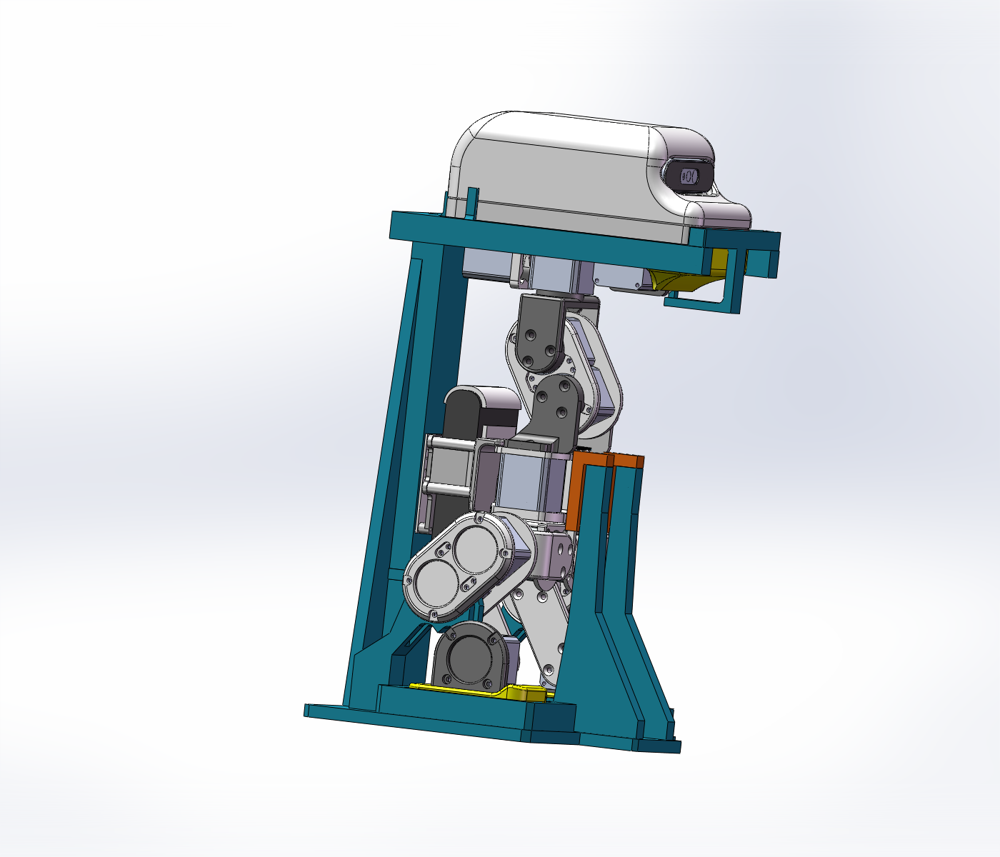

# 整机站姿零位工装

[English](README.md) | 简体中文

用四个 PLA 打印件将已装配的 Wamoduck 定位到保存的默认站姿，再记录 15 个伺服电机的输出端编码器零偏。工装定位双脚、已确认的髋部下方电机壳体托面、Body、头部和闭合嘴部。螺钉只连接工装分件，工装与机器人之间不用螺钉固定。

本目录采用维护者 **2026-09-14 手动优化的 P01**，以及与之匹配的 H2D 工程。重新导出 STEP、复核 CAD 时，原生 SolidWorks 文件均以只读方式打开。

## 下载与打印

1. 下载仓库，用 Bambu Studio **作为工程打开** [H2D_PLA_standing_zero.3mf](bambu/H2D_PLA_standing_zero.3mf)。工程包含两个打印盘、四个零件、摆放方向与参数，保存版本为 Bambu Studio 02.08.02.60。
2. 确认 H2D、0.4 mm 喷嘴、PLA 与实际使用的打印板。工程保存的是 SuperTack 板，全部零件使用耗材槽 1 的 Bambu PLA Basic；实际耗材或板型不同时，选择对应预设。
3. 重新切片两个盘，检查支撑接触与高立柱区域，再打印。该 3MF 不含 G-code，需要切片。第 1 盘和第 2 盘各打印一次即可，不要再向工程重复添加另附的 STL。

| 零件 | 打印数量 | H2D 打印盘 | 打印包络，mm | 功能 |
| --- | ---: | ---: | --- | --- |
| [P01_Main_frame](stl/P01_Main_frame.stl) | 1 | 1 | 200 × 260 × 315.83 | 底板、脚槽、V 托、前支撑、后立柱和加强筋一体 |
| [P02_Head_cradle](stl/P02_Head_cradle.stl) | 1 | 2 | 220.5 × 130.4 × 38.8 | 头部承托、后挡和侧挡 |
| [P03_Head_keeper_mouth](stl/P03_Head_keeper_mouth.stl) | 1 | 2 | 130.4 × 54.112 × 47 | 头部前挡与嘴部承托一体 |
| [P04_Body_bridge](stl/P04_Body_bridge.stl) | 1 | 2 | 28.249 × 52 × 64 | 带一体接触面的 Body 前桥 |

**合计四个打印件、六颗螺钉。** 数量表另存于 [print-parts.csv](print-parts.csv)。

工程实际保存的参数为：0.20 mm 层高、**2 道墙、20% 蜂窝填充、自动 5 mm brim、普通自动支撑、无 raft**，按层打印。这里原样保留维护者的工程设置；之前本地说明中的 6 道墙、35%～45% 填充不是本工程的参数。目前尚未附首件实打或承载测试记录。

自行切片时，STL 已按打印方向导出：P01 底板朝下立打、P02 底面朝下、P03 外侧平面朝下、P04 侧面朝下。按 325 × 320 × 325 mm 的 H2D 包络检查，P01 高度余量约 9.17 mm；应以切片后的模型、支撑和附着结构总体包络再次核对。尽量避开定位面设置支撑接触，试装前清除残留。

## 文件、单位与版本

| 目录／文件 | 用途 |
| --- | --- |
| [step/](step/) | 四个用于跨 CAD 软件编辑的实体，毫米单位，保留共同装配坐标 |
| [stl/](stl/) | 四个用于切片打印的网格，毫米单位，已设置打印朝向 |
| [bambu/](bambu/) | 内含模型、摆盘和打印设置的 H2D PLA 双盘工程 |
| [validation.json](validation.json) | 对应本版文件的数字几何与工程检查记录 |
| [manifest.json](manifest.json) | 文件大小、SHA-256 与导出来源记录 |

STEP 和 STL 都可将几何交给支持相应格式的切片软件；3MF 工程还保存摆放与打印设置。Bambu Studio 对 STEP／STL／3MF 的导入方法见 [H2D 用户手册](https://csm.bblcdn.com/hub/4668d0ca43994ff3bff4b37f1a65c2e7.pdf)。

STEP 保留装配位置，STL 保留打印朝向，因此两者原点不同。公开 P01 STL 仅平移到从零开始的打印包络，形状与拓扑不变；P02～P04 原样复制。公开 3MF 仅清除了一个账户标识，模型、摆盘和工艺参数不变。原生工作文件及旧校验报告保留在本地，不混入此公开目录。

## 配合与紧固件

设计名义值：**M3×0.5 攻牙底孔 Ø2.5 mm，过孔 Ø3.3 mm，杯头沉孔 Ø6.5 × 3.2 mm 深，分件总配合间隙 0.4 mm**。总间隙不是每侧 0.4 mm；它按 PLA 标称 ±0.2 mm 打印公差预留，实际首件配合仍需检查。

| 连接 | 螺钉 |
| --- | --- |
| P01 → P02 | 2 颗 M3×25 内六角杯头螺钉 |
| P02 → P03 | 2 颗 M3×16 内六角杯头螺钉 |
| P01 → P04 | 2 颗 M3×16 内六角杯头螺钉 |

去除毛刺与象脚后，对 Ø2.5 孔手工攻 M3×0.5 螺纹；装机器人前检查杯头落肩与盲孔深度，再手动交替锁紧每组螺钉。无需铜螺母或其他嵌件。杯头依靠沉孔平肩承压，Ø6.5 与 Ø3.3 之间的窄承压环不要做 C2；嘴托入口另有 C2 导入倒角。

P02 后挡、侧立挡外侧根部有 R3 圆角；P03 嘴托内侧根部为 R4、上端吊臂根部为 R3。这些结构已包含在 STEP、STL 和 3MF 中。

[查看头挡与嘴托根部细节](images/roots.png)。

## 装配与零位记录

一体 V 托要求手动调整关节后就位，不能将固定站姿的整机直接从上方一次插入。

1. 关闭电机驱动使能，确认关节能缓慢手动转动。读取编码器时可保留控制器与编码器供电。将 P01 放在平整稳固的台面。
2. 手动调整腿部，把双脚放入脚槽，再调整对应关节，使下方电机壳体面轻落到两侧 V 托，保持线束出口畅通。
3. 用两颗 M3×25 将 P02 装到立柱顶部定位键，让头部轻贴对应支撑。
4. 将 P03 从机器人前方沿水平开口槽滑入，以两颗 M3×16 固定。嘴托比模型闭嘴位置低 0.2 mm；嘴部零位以机构闭合状态确认，不强压嘴部贴上托面。
5. 安装 P04，沿前后长孔整体移动，直至一体接触面轻贴 Body，再用两颗 M3×16 固定。前桥与下方、后方支撑配合限制 Body 前倾，没有需要分别调节的接触垫。
6. 在各基准轻贴、驱动仍未使能的状态下，记录对应输出端编码器读数／偏置。不要使打印框架明显弯曲或用螺钉拉动关节就位；重复放置检查一致性后再采用标定结果。

编码器内置在电机中，标定不需要拆卸或调整编码器本体。实际电机 ID 映射及转向约定需随机器人记录。URDF 的 `q=0` 表示保存的模型站姿，不等于电机出厂编码器零位；这里记录的偏置用于建立两者对应关系。[MATLAB 回放器](../../../tools/matlab/README.md)使用模型关节坐标，不会向硬件写入零偏。

## 已检查范围

更新后的原生 CAD 每件为一个实体，所查特征无报错，默认站姿下涉及工装的静态重叠检测为零。四个最终 STL 已通过记录中的水密性、退化三角形及打印包络检查，3MF 中四个模型均与对应源 STL 在数值精度范围内一致。

上述检查针对数字文件。目前没有首件配合、结构承载、重复定位精度或整机标定的实测结果。本工装用于手动定位标定，不用于电机使能后的动作测试。
