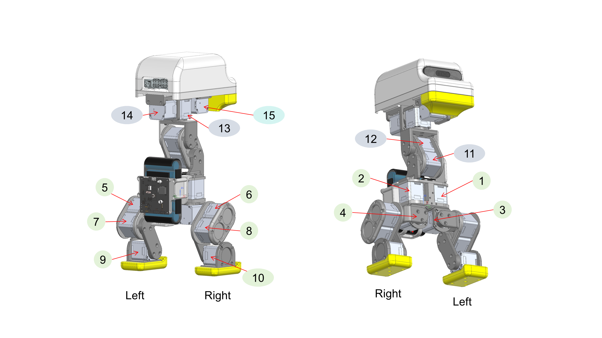

# Motor IDs on the CAN-FD bus

[Home](../README.md) · English | [简体中文](motor_ids.zh-CN.md) · [Model guide](../docs/model.en.md) · [Simulation guide](../docs/simulation.md)



*Two CAD views of the same robot, with the bus ID printed beside each motor and `Left` / `Right` written under the legs.*

This page is **hardware and interface information only**. It records which bus ID belongs to which joint, which of the three CAN-FD buses that motor sits on, and how the 14 values a policy outputs map onto those IDs. It says nothing about whether a policy stands up or walks: every result in this repository is a simulation result, and no policy here has been tested on a physical robot.

## What is in this directory

| File | What it is |
| --- | --- |
| [motor_ids.csv](motor_ids.csv) | The mapping table, one row per motor |
| [motor_ids.json](motor_ids.json) | The same content, machine-readable |
| [../assets/wamoduck-motor-ids.png](../assets/wamoduck-motor-ids.png) | The position drawing above |

The source workbook `List_MotorID_CANFD.xlsx` and the source deck `Motor_ID_location.pptx` are **not redistributed** in this repository. Only the derived table and the exported drawing are published here.

## Three CAN-FD buses

- The **AT32** main control board runs **three physical CAN-FD buses**, each on an **XT30(2+2)** connector. That connector carries power and CAN-FD together.
- The three buses are one for the **left leg**, one for the **right leg**, and one for the **neck and head**.
- Each bus carries **5** motors, so that is **3 × 5 = 15**, which is exactly the **15** rows of the maintainer's source table. The bus split and the source table agree.
- **The three buses share one ID space, and the IDs on a single bus are not consecutive.** The left-leg bus carries IDs **1, 3, 5, 7, 9**; the right-leg bus carries **2, 4, 6, 8, 10**; the neck-and-head bus carries **11, 12, 13, 14, 15**. A left-leg bus therefore does **not** use 1, 2, 3, 4, 5. This is counter-intuitive, and it is the first thing to get right when wiring.
- That ID assignment was stated by the maintainer on **2026-09-16**, and it is the reason the source table numbers the two sides alternately.

## The mapping

| Bus | Bus ID | Joint | Chinese name | Side | In the policy action vector |
| --- | ---: | --- | --- | --- | --- |
| left_leg | 1 | `left_hip_yaw` | 左髋偏航 | left | yes |
| left_leg | 3 | `left_hip_roll` | 左髋侧摆 | left | yes |
| left_leg | 5 | `left_hip_pitch` | 左髋俯仰 | left | yes |
| left_leg | 7 | `left_knee` | 左膝关节 | left | yes |
| left_leg | 9 | `left_ankle` | 左踝关节 | left | yes |
| right_leg | 2 | `right_hip_yaw` | 右髋偏航 | right | yes |
| right_leg | 4 | `right_hip_roll` | 右髋侧摆 | right | yes |
| right_leg | 6 | `right_hip_pitch` | 右髋俯仰 | right | yes |
| right_leg | 8 | `right_knee` | 右膝关节 | right | yes |
| right_leg | 10 | `right_ankle` | 右踝关节 | right | yes |
| neck_head | 11 | `neck_pitch` | 颈俯仰 | center | yes |
| neck_head | 12 | `head_pitch` | 头俯仰 | center | yes |
| neck_head | 13 | `head_yaw` | 头偏航 | center | yes |
| neck_head | 14 | `head_roll` | 头侧倾 | center | yes |
| neck_head | 15 | `mouth` | 嘴开合 | center | **no** |

- The joint names are the names in [wmduck.urdf](../models/wmduck/wmduck.urdf). All 15 of them were checked against the URDF one by one.
- **One correction to the source.** The source table spells the bus 2 joint `Rightt_hip_yaw`. That is a typographical error: the URDF and the MJCF both spell the joint `right_hip_yaw`, and that is the spelling used here. The `note` field of [motor_ids.csv](motor_ids.csv) records the original spelling.
- **Bus ID 15 is not driven by a policy.** The published policies output **14** values, not 15: they have no beak axis. `mouth` is a real revolute joint in the URDF and a real motor on the neck-and-head bus, but it is not in the action vector, so `driven_by_policy` is `false` for it and `action_index` is empty. Bus IDs 1 to 14 are the ones a policy drives. Bus ID 15 is held back as a spare degree of freedom for interaction features, which are **planned and not implemented** — see the [roadmap](../docs/roadmap.md) for what is planned and for what the model actually contains today.

## Two different orders, and the permutation between them

There are two orders in this project, and they are **not** the same:

| Order | What it is, in order |
| --- | --- |
| Bus ID order | 1, 2, 3 ... 15 — left/right interleaved (left hip yaw, right hip yaw, left hip roll, ...) |
| Joint-tree order | left leg 5, then right leg 5, then neck and head 4 — the 14 joints a policy actuates |

The bus ID order is the order of the `<actuator>` block in [robot_walk.xml](../models/wmduck/mjcf/robot_walk.xml), the MJCF the published policies were trained in: `act_left_hip_yaw`, `act_right_hip_yaw`, `act_left_hip_roll`, and so on.

The 14-dimension action vector, however, is read as **joint-tree order**: element 0 is the left hip yaw, element 4 is the left ankle, element 5 is the right hip yaw, and elements 10 to 13 are the neck and head. That is the reading the [simulation guide](../docs/simulation.md) states.

**So firmware and any host program have to permute once**, from action index to bus ID:

```text
bus_id(action_index) = [1, 3, 5, 7, 9, 2, 4, 6, 8, 10, 11, 12, 13, 14]     # action index 0..13
```

Read it as: `action[0]` is the left hip yaw and goes to bus ID 1, `action[1]` is the left hip roll and goes to bus ID 3, `action[2]` is the left hip pitch and goes to bus ID 5, `action[3]` is the left knee and goes to bus ID 7, `action[4]` is the left ankle and goes to bus ID 9, `action[5]` is the right hip yaw and goes to bus ID 2, and so on; `action[10]` to `action[13]` are the neck pitch, head pitch, head yaw, and head roll, and go to bus IDs 11, 12, 13, and 14 unchanged.

> ### ⚠️ Do not power the servos on the strength of this permutation
>
> **The permutation above has not been verified on a physical robot.** Until there is independent evidence for it, do not use it to energise the servos. A wrong joint order mis-drives a joint, and in this project's own simulation a wrong order collapses the robot within a second.
>
> It is also **not settled**. An internal deployment-contract file interprets the 14-dimension action vector in **actuator order** rather than joint-tree order, and this repository's ROS 2 module [`model_contract.py`](../ros2/wamoduck_ros2/wamoduck_ros2/model_contract.py) does the same. Under that reading `action[1]` is the target for bus ID 2, whereas this page sends it to bus ID 3, so the two readings disagree for `action[1]` to `action[8]`. Nobody has adjudicated that disagreement yet. Treat the permutation as a hypothesis to be checked against the hardware, not as a wiring instruction.
>
> The three-bus topology is unverified on hardware in the same way: the **direction and polarity** of each bus, its **termination resistors**, and the ID assignment **as actually programmed into the servos** have not been checked on the machine.

## Where the drawing comes from

- The source is slide 1 of 1 in the maintainer's deck `Motor_ID_location.pptx`.
- That deck contains **two** embedded PNG renders and no others; the CAD views by themselves carry no bus IDs.
- The numbers 1 to 15 and the `Left` / `Right` labels are separate text shapes drawn over the images, so exporting the slide is the only faithful form of the annotation. The export was produced with Microsoft PowerPoint at **2400 × 1350** pixels and is published unmodified.
- The drawing is **not** a photograph of the robot, and it is not evidence that any of these motors has been wired or driven.

## What this page does not claim

- It does not claim that the robot works, or that any policy can stand or walk. It is a bus ID table.
- It does not claim that these IDs have been checked against a physical harness. No CAN bus was opened to write this page.
- Bus IDs, bus topology, joint names, and orders are interface facts. Keep them apart from behaviour results, which are on the [measured capability board](../docs/capabilities.md).

## Related pages

- [Model guide](../docs/model.en.md) — joint names, axes, and limits.
- [Simulation guide](../docs/simulation.md) — the observation layout, the joint-tree order, and the action mapping.
- [Mechanical design](README.md) — the STEP and SolidWorks files.
