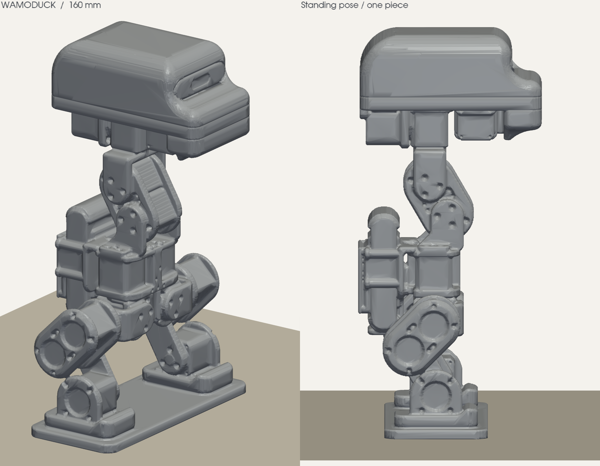

# Wamoduck standing display for Bambu Lab A1 mini

[中文打印说明](README_打印说明.md) · [Printable releases index](../README.md)

This package produces a **fixed, nonfunctional 160 mm display model** from the Wamoduck URDF at the saved q=0 standing pose. All 15 articulated axes are fused with hidden reinforcement pins; the joints cannot move. Thin surfaces and assembly gaps are consolidated for display printing, so this model is not a manufacturing export or a substitute for functional robot structure.



## Download and print

Open [Wamoduck_A1mini_PLA_160mm.3mf](Wamoduck_A1mini_PLA_160mm.3mf) as a project in Bambu Studio. It contains the model, generated toolpath, and the validated A1 mini settings. The geometry-only [Wamoduck_Standing_160mm.stl](Wamoduck_Standing_160mm.stl) is available for users who need to reslice. [Wamoduck_Standing_160mm.3mf](Wamoduck_Standing_160mm.3mf) is the geometry export; use the A1 mini project above for the saved print configuration.

The validated digital slice uses:

- Bambu Lab A1 mini with a 0.4 mm nozzle;
- one spool of Generic PLA, no AMS or colour changes;
- 0.16 mm layers and a 0.20 mm first layer;
- three walls and 15% gyroid infill;
- automatic tree supports with three top interface layers;
- an 8 mm outer brim on a Textured PEI Plate.

Bambu Studio 02.08.02.60 completed the slice without a reported warning. Its estimate is **11 h 56 min 37 s** and **150.26 g PLA**, including supports, for 1,000 layers. These are slicer estimates. A physical print has not been completed or tested.

The final model is approximately **73.86 × 97.58 × 160.00 mm**, including its integral base. Keep it at 100% import scale to retain the validated dimensions and reinforced thicknesses. Preserve the standing orientation and tree supports around the head, beak and body overhangs.

## Validation and reproducibility

[geometry_validation.json](geometry_validation.json) records the final STL hash, dimensions, triangle count, one-shell/watertight checks, outward winding, positive volume, bottom cap, and source URDF hash. [slicing_validation.json](slicing_validation.json) records the public slicer result, configuration hashes, embedded settings, archive hash, footprint, support statistics, material estimate, and time estimate.

The geometry can be rebuilt from [source/build_model.py](source/build_model.py) using the pinned packages in [source/requirements.txt](source/requirements.txt):

```powershell
python -m pip install -r source/requirements.txt
python source/build_model.py build
python source/build_model.py render
```

The script depends on the repository's URDF and source meshes at their existing relative paths. It omits the zero-thickness IMU sheet, scales the source pose, voxel-unites the visible geometry, adds reinforcement, repairs the result into one shell, and exports millimetre-scale output. Rebuilding the STL does not update the saved sliced project automatically; rerun the documented [offline slicing workflow](slicing/README.md) after any geometry change.

Digital validation proves that the checked geometry is a closed single shell and that Bambu Studio generated a toolpath with the recorded settings. It does not prove surface quality, support removability, strength, dimensional accuracy, printer calibration, or a successful physical print.
